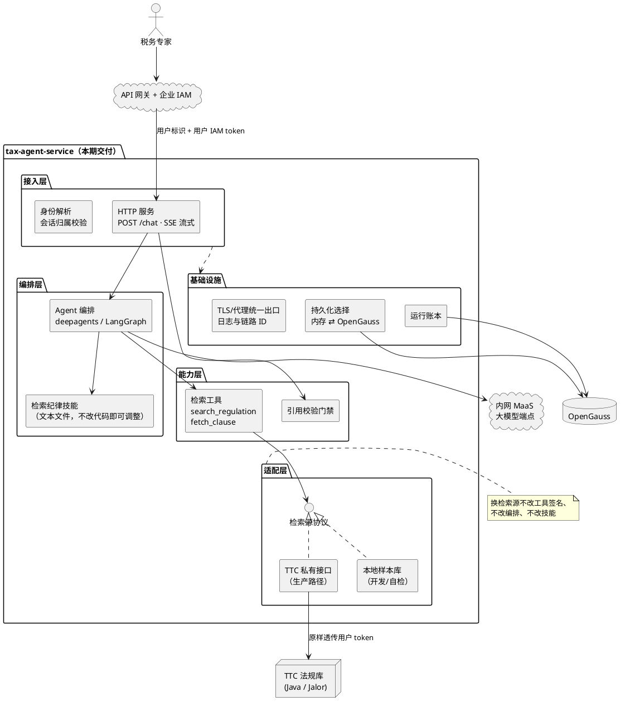
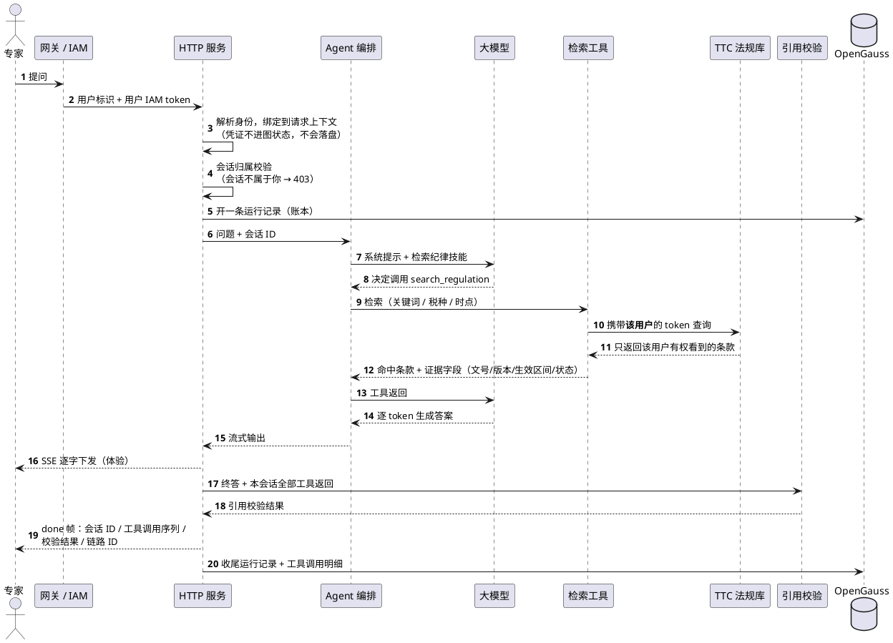
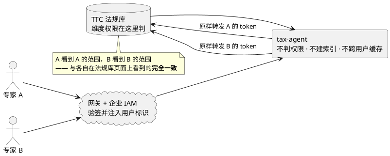
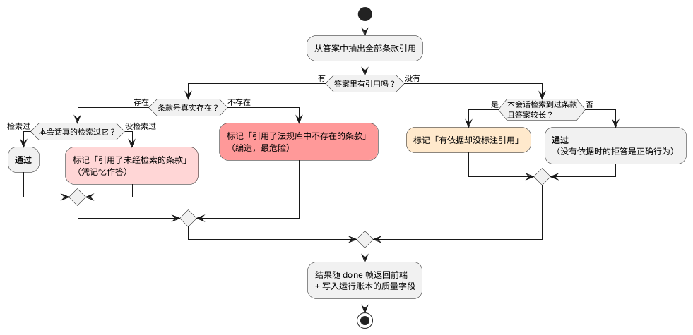

# 税法检索与解读 Agent — 技术方案说明

> 2026-09-20 · 面向汇报，用于对齐建设思路
> 详细实现见 `superpowers/specs/` 下的设计与计划文档，本文只讲「为什么这么建」。

---

## 1. 一句话

给企业税务专家一个**每句话都能追溯到法规原文**的问答入口：它自己不记税法，
所有依据都必须当场从公司法规库（TTC）检索出来，查不到就如实说查不到。

---

## 2. 为什么要做成 Agent，而不是接个大模型问答

税务专家要的不是「一段读起来像那么回事的文字」，而是**能拿去支撑申报决策的依据**。
直接接大模型有三类失败，而且都很难被人眼发现：

| 失败模式 | 表现 | 后果 |
|---|---|---|
| **编造条款号** | 引用一个格式完全正确、实际不存在的文号 | 最危险。看起来最可信，专家核对成本最高 |
| **用错版本** | 拿今天的现行条款回答两年前那笔业务 | 结论常常正好相反，而且从答案里看不出错在哪 |
| **越权作答** | 替用户把金额代入算出税额、给出确定性合规结论 | 用户直接拿去申报，责任边界模糊 |

这三类问题**靠提示词约束是不够的**——提示词是建议，不是保证。所以本方案的重心不在
「把模型接通」，而在**把这三类失败变成工程上可拦截、可度量的东西**：

- 编造 → 服务端强制引用校验（第 6 节）
- 版本 → 时点检索与状态过滤做成两套独立机制（第 5 节）
- 越权 → 系统提示 + 行为评测用例双重约束，并写进能力红线（第 7 节）

**一句话概括建设思路：把「可追溯」做成系统属性，而不是模型的自觉。**

---

## 3. 总体架构

分五层，每层只解决一件事，换一层不影响其余层。

**分层的实际收益**：本地开发用样本库零依赖起服务；内网联调只换一个环境变量指向
TTC；模型端点、数据库、检索源三者各自独立可换。这不是为了"架构好看"——内网调试
成本最高，能在本地跑完的验证绝不留到内网。

---

## 4. 一次问答的完整链路

两个设计要点：

- **引用校验放在流式结束之后、就地完成**，不额外调一次模型。答案已经攒在服务端，
  证据集就是本会话真实的工具返回，比较是纯字符串运算，零成本。
- **校验结果随 done 帧返回给前端**，不隐藏也不自动改写答案。改写会掩盖真实质量，
  前端拿到问题清单才能决定是提示用户还是拦下。

---

## 5. 关键技术决策

| # | 议题 | 决策 | 为什么这么定 | 代价 / 前提 |
|---|---|---|---|---|
| 1 | 鉴权 | **只透传用户真实 IAM token** | 自签 token 法规库不认；应用级凭证调不了私有接口，且没有用户身份 | 依赖网关把 token 放行到法规库 |
| 2 | 数据权限 | **完全委托法规库**，不自建权限层 | 保证「Agent 不让你看到页面上看不到的东西」 | 不能自建索引、不能跨用户缓存检索结果 |
| 3 | 调哪些接口 | **与法规库前端页面一致** | 页面调什么我们调什么，权限语义自动对齐，无需假设对方的过滤实现 | 受页面接口能力约束 |
| 4 | 检索源 | 一套协议 + 三个实现，环境变量切换 | 本地开发 / 公有 API 验证 / 生产走同一份代码 | 无 |
| 5 | 检索纪律 | 写成**技能文本文件**，不写进代码 | 调纪律不用改代码、不用发版，评测直接回归 | 技能加载失败是静默的 → 用装配自检兜住 |
| 6 | 防编造 | 服务端**强制**引用校验 | 编造条款号是最危险、最难被人眼发现的失败 | 只报问题不改答案 |
| 7 | 版本与时点 | `as_of`（时点）与 `include_historical`（当前状态）**两套独立机制** | 「当年那笔业务适用什么」和「这政策现在还有效吗」是两个问题，合并必出错 | 检索源做不到时点检索必须显式拒绝，不许忽略参数照常返回 |
| 8 | 已废止条款 | 默认不返回，但**探明并回报条数** | 修掉「问某政策是否还有效 → 默认检索返回 0 → 答查不到」这个死角。把"已废止"说成"不存在"比说不知道更糟 | 历史条款不自动变成证据，需模型显式重查 |
| 9 | 不算税额 | 系统提示 + 评测用例双重约束 | 算错直接进申报表 | 牺牲一部分"一站式"体验 |
| 10 | 持久化 | 内存 / OpenGauss 在**一处**做选择 | 本地零依赖起服务；生产多实例共享会话与检查点 | 数据库环境变量配一半必须启动即失败，绝不静默退回内存 |
| 11 | 可观测 | 链路 ID 贯穿 + 运行账本 | 「模型答得不对」要能定位到是召回没中、过滤误杀，还是校验拦下 | 账本只存 hash 与计数，不存原文 |

### 5.1 权限这条线单独说明

这是最容易被问到的一点：**Agent 会不会让人看到不该看的东西？**

我们**刻意不做**的三件事，都是为了守住上面那句话：

1. **不自建向量库 / 搜索索引**。一旦自己建索引，索引里就有全量数据，权限就变成我们
   自己实现的一层代码——它一定会和法规库的权限模型漂移。
2. **不跨用户缓存检索结果**。缓存是最隐蔽的越权通道。
3. **不接受调用方自称的用户身份**。用户标识只认网关注入的那个头。也因此，
   **这个服务必须部署在网关后面**，网络层要保证只有网关可达——这是上线前置条件。

---

## 6. 防编造：门禁怎么工作

答案生成完之后，服务端做一次强制校验。判定依据只有一条：
**答案里引用的每个条款号，都必须真实存在，且本会话确实检索过。**

几个已经踩过、现在被这道门禁覆盖的真实坑：

- **条款号形态**比想象的杂：段内混大小写、带斜杠（跨税地条款）都真实存在。旧的识别
  规则认不出带斜杠的号，于是编造一个带斜杠的文号可以**静默绕过整道门禁**。
- **中间独白不算答案**。模型在多轮检索之间会自言自语（"这条看起来相关，再确认一下"），
  里面提到的合法条款号如果被算进答案，能把一个毫无依据的终答"洗"成合格。
- **证据集按整个会话算，不按单次请求算**。追问时模型常引用上一轮已真实检索过的条款做
  延伸解读，这是合法的，按单次请求算会误伤。
- **无依据的长篇拒答要放行**。「检索不到，建议核实税种名称」本来就该长而无引用。

---

## 7. 能力边界（红线）

这些是**故意不做**的，写进代码约束和评测用例，不是待办事项：

| 类别 | 红线 |
|---|---|
| 业务 | 不做具体税额计算——不把用户给的金额代入算出结果，只给税率、规则和还差哪些调整项 |
| 业务 | 不出具确定性合规结论——"这样申报没问题吧"只回可核查的事实与待确认项 |
| 业务 | 问题信息不足时**回问**，不替用户猜（例如只说"2024 年 3 月"不补成 1 号——政策月中切换真实存在） |
| 权限 | 不自建权限层、不预建索引、不跨用户缓存、不接受调用方自称的身份 |
| 安全 | 用户 token、模型密钥、条款正文全文，一律不进日志、不落库；账本只存 hash 和计数 |
| 安全 | 凭证不进 Agent 的图状态——图状态会随检查点落盘并在恢复会话时回灌 |
| 部署 | 服务必须在网关后面，网络层保证只有网关可达 |

---

## 8. 工程化配套

不是额外工作量，是让上面那些约束**保持有效**的手段：

| 手段 | 做法 | 解决什么 |
|---|---|---|
| **模块自检** | 14 个模块各自带一个可直接运行的自检，不引测试框架 | 改一处能立刻验证，内网现场也能一行命令区分"环境问题"还是"代码问题" |
| **行为评测** | 14 条用例，4 类：引用可追溯 / 版本与时点 / 该拒答时拒答 / 能力边界 | 检索纪律和提示词是文本，改了必须能回归。模型输出有抖动，看通过率不看单次 |
| **统一错误码** | 鉴权失败、越权、上游不可用等分别给确定的码 | 前端能按码分支，不用猜文案 |
| **链路 ID 贯穿** | 一个 ID 串起 HTTP 响应头、服务日志、工具日志、运行账本 | 用户报"这个答案不对"，凭一个 ID 能拉出全过程 |
| **运行账本** | 每次问答一条运行记录 + 每次工具调用一条明细（状态、耗时、证据条数） | 回答质量、调用成本、失败分布都能统计；只存 hash 和计数 |
| **健康检查** | 存活探针，不主动探活上游 | 上线必备；探上游会被高频探测打成对上游的压测 |

---

## 9. 进度与下一步

### 已完成（本地可完整运行、可演示）

- 检索与解读主干：HTTP 服务 + SSE 流式 + 会话续聊
- 身份链路：网关头优先、凭证不进图状态、会话越权返回 403
- 引用校验门禁 + 14 条行为评测
- 版本与时点机制（时点检索、废止/替代状态、已废止死角探测）
- TTC 适配器（含离线契约验证，内网只需联调不需开发）
- 持久化选择层（内存 ⇄ OpenGauss，会话绑定 + 检查点）
- 运行账本两张表
- 上生产必备：统一错误码、链路贯穿、流中错误帧、健康检查

### 待内网验证（已备《内网联调手册》，进场即可执行）

1. **身份链路是否真正解析出"是谁在查"**——必须用两个维度权限不同的账号比对结果集才
   能证实，单账号会给假阳性。这是本期最关键的一个待验证项。
2. 内网根证书，用来替换联调期的证书校验降级。
3. 法规库对外路径形状、过期 token 的确定返回码。

### 二期范围（已划出，本期不做）

法规感知与变更通知、上游不可用时的降级闭环、专家审核回流、订阅与推送。

---

## 10. 一句话总结

本期建设的核心不是"接通了一个大模型"，而是**把"答案可追溯"从模型的自觉变成了系统的
硬约束**：权限完全委托法规库、依据必须当场检索、引用必须通过服务端门禁、全过程留账。
剩下的工作量集中在内网身份链路的实证验证上。
