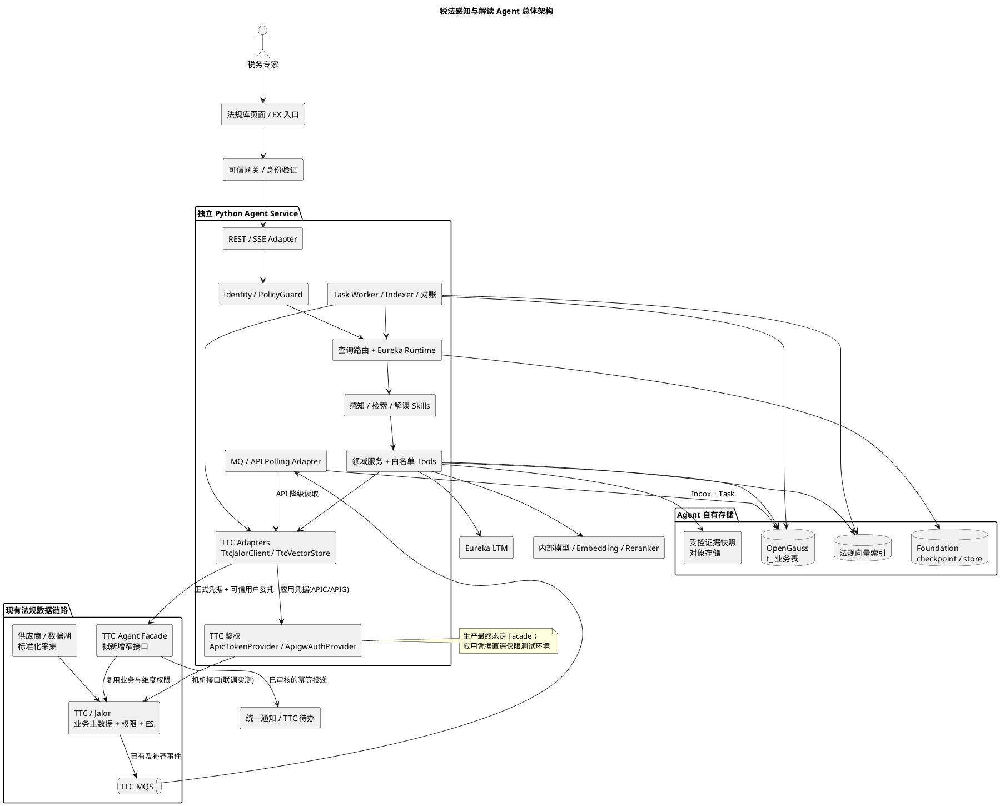
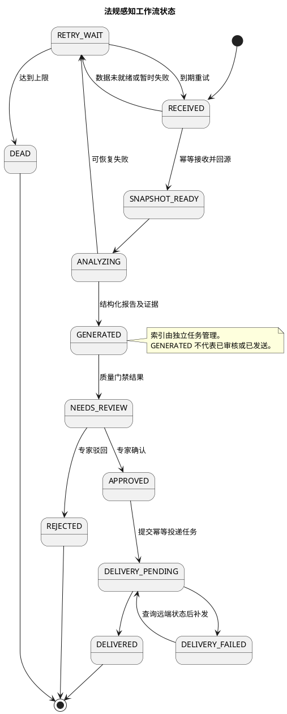
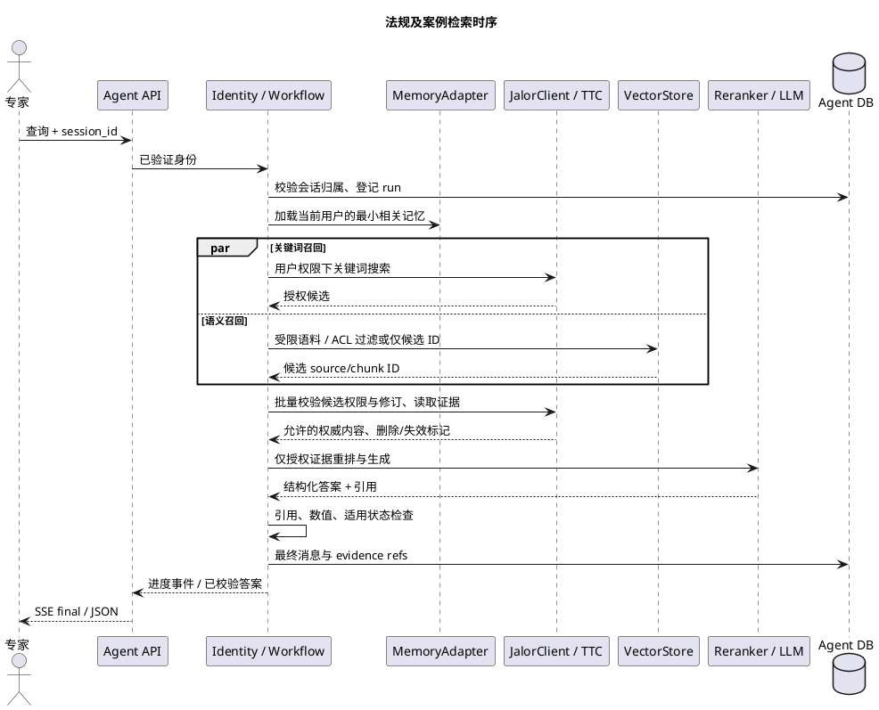
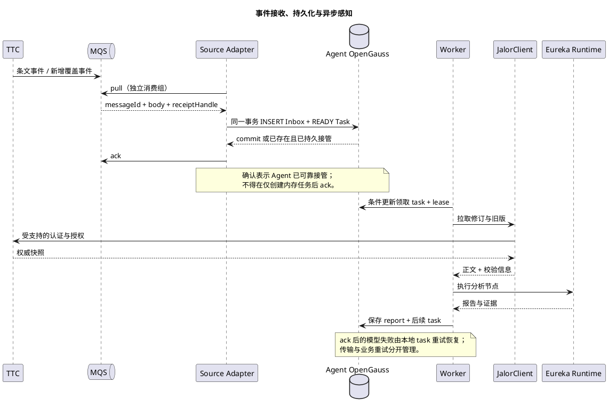
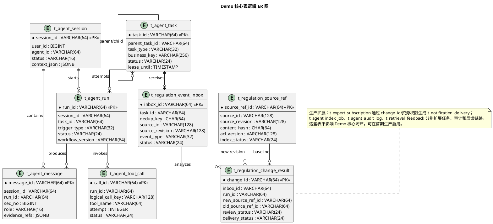
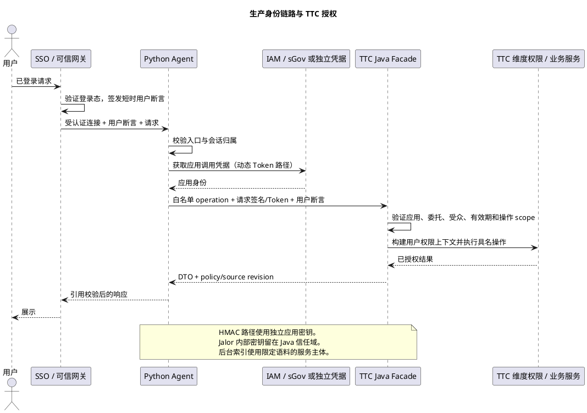
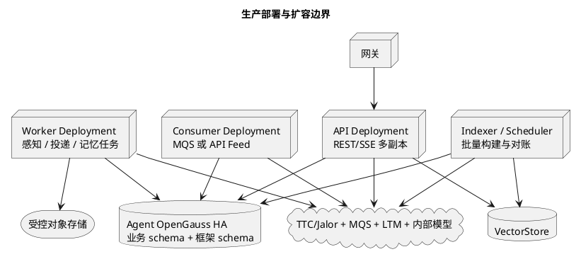

# 税法感知与解读 Agent 系统架构技术方案

版本：1.0（设计评审稿）  
日期：2026-09-15  
目标：2026 年 12 月上线法规库页面；此前完成 Demo 与测试环境验证。  
设计依据：REQUIREMENTS.md、业务汇报及 Demo、TTC 源码、Eureka X Foundation 文档、法律评审及智能风控 Agent 参考实现。

本文区分“源码已存在的能力”“本方案新增的契约”“上线前的验证条件”。接口与表结构中的新增名称是设计定义，不代表已经在 TTC 或 Eureka 上部署。测试环境验证记录来自参考项目文档；本次没有调用其测试环境或验证生产配置。

## 目录

- [1. 目标、范围与架构决策](#s1)
- [2. 现有系统核查与差距](#s2)
- [3. 技术栈选型与框架比较](#s3)
- [4. 整体架构与模块职责](#s4)
- [5. Skill、Tool 与确定性工作流](#s5)
- [6. MQ、增量轮询与一致性](#s6)
- [7. 数据归属与表结构设计](#s7)
- [8. 系统接口与协议](#s8)
- [9. 鉴权、安全与法律评审方案复用](#s9)
- [10. 记忆、RAG 与智能检索词](#s10)
- [11. 部署、容灾与可观测性](#s11)
- [12. Demo、首期生产与后续分期](#s12)
- [13. 测试、验收与容量规划](#s13)
- [14. 交付拆分与前置依赖](#s14)
- [15. 代码与资料证据索引](#s15)

<a id="s1"></a>
## 1. 目标、范围与架构决策

### 1.1 业务目标

系统面向税务专家、机关 COE、延伸 COE 和税务经理，提供两个核心闭环：

1. 法规感知：消费现有标准化法规数据，识别新增、修订、废止、生效变化，生成带证据的变化摘要与影响候选，经专家确认后推送或创建待办。
2. 法规及案例检索：结合语义、关键词、页面上下文和历史检索行为，定位法规及条款，推荐标签和高频检索词，支持有引用的多轮解读。

业务材料显示已有供应商采集、数据湖、法规入库和待办推送链路，痛点包含海外来源质量不稳定、推送粒度过大和专家处理率低。因此效果评估同时关注正确性、噪声降低和专家采纳率，不能仅以抓取量、摘要数量作为成功标准。

### 1.2 已确认的设计决策

| 编号   | 决策                            | 约束与结果                                                   |
| ------ | ------------------------------- | ------------------------------------------------------------ |
| ADR-01 | 独立 Python Agent Service       | 与 TTC Java/Jalor 服务独立部署，通过稳定接口集成             |
| ADR-02 | 首期复用现有采集与数据湖链路    | 不新建外部爬虫；工具保留来源适配接口，未来再扩展             |
| ADR-03 | MQ 优先、API 权威校准、定时对账 | Demo/首期无 MQ 消费权限时采用 API 拉取；明确接口缺口，不能假设分页接口天然支持可靠增量 |
| ADR-04 | Eureka X Foundation 为主框架    | 通过适配层使用 Runtime、Web、隔离、持久化、LTM、MQS 和 RestClient |
| ADR-05 | TTC 拥有法规业务主数据          | Agent 保存运行态、分析结果、证据快照及可重建检索投影，不复制业务主表 |
| ADR-06 | 自建关系表统一 `t_` 前缀        | Eureka 框架表保留原名；框架迁移与业务迁移分开                |
| ADR-07 | 受控工作流承载关键业务步骤      | Skill 指导分析；状态、权限、幂等、审核及发送由代码强制执行   |
| ADR-08 | Demo 与生产鉴权分开             | 测试使用应用凭据（APIC 动态 token / APIG AK-SK）直连 SYSTEM 机机接口（已实测）；生产使用 TTC Agent Facade 代用户调用 + 正式动态凭据 |
| ADR-09 | 用户记忆与法规知识分开          | 用户记忆优先接 Eureka LTM；法规知识使用版本化 RAG 索引       |
| ADR-10 | 按 Demo、首期生产、后续增强分期 | 表和部署组件随闭环需要启用，避免 Demo 承担全部运营功能       |

### 1.3 业务边界

首期涵盖法规/条款/已有案例检索、变化摘要、证据追溯、专家复核和通知集成。流程知识、内部术语可通过后续知识源适配扩展；自动出具正式税务意见、自动修改计税规则、自动审批、跨系统税额测算不纳入本期闭环。

“发布态”指 TTC 内容发布流程状态；“生效/失效”指法规法律效力，两者分别建模。Demo 以已发布内容验证完整链路。生产扩展到原文入库后即感知时，允许处理已进入受控数据链路的待审原文，但结果标注“待专家审核”，仅授权审核人可见，不进入默认已发布法规检索集合。

“实时”拆成来源发布到上游采集、上游采集到 TTC 可读取、TTC 可读取到 Agent 产出三个区间。Agent 只能对后一区间直接承诺处理时效。

<a id="s2"></a>
## 2. 现有系统核查与差距

### 2.1 TTC 可复用能力

| 已核实内容                        | 代码依据                                                     | 对设计的意义                                      |
| --------------------------------- | ------------------------------------------------------------ | ------------------------------------------------- |
| 法规库处于 TTC 多模块 Java 服务内 | `TaxRegulation` 的 application/domain/infrastructure 分层    | 沿用原应用服务和权限逻辑，新增面向 Agent 的窄接口 |
| 条文 MQ Producer                  | `TaxClauseMessageProducer`、`web.mqs.configs.xml`            | 已具备条文消息输出基础，无须重新选择消息中间件    |
| 条文提交及同步消息触发            | `TaxClauseAppService.submitTaxClause/sendTaxClauseMessage/sync`；导入消费者 | 存在事件触发点，但需要逐条确认覆盖及事务语义      |
| 原文与威科修订记录集成            | `TaxRegulationIntegrationProcessor`、`WacoRecordUpdateIntegrationProcessor` | 新原文感知应衔接此链路，不能只等人工条文发布      |
| 已发布条文、详情、历史及搜索 API  | `TaxClauseController`                                        | 支撑回源、历史对比和关键词检索                    |
| ES 检索                           | `EsSearchAbility`                                            | 关键词召回通过 Jalor API 复用，不由 Agent 直连 ES |
| 数据维度权限                      | `DimensionPermissionAbility`                                 | 区分原文、条文、案例等资源权限，Agent 不自行替换  |
| 已有站内通知封装                  | `CommonAbility.send`                                         | 复用业务能力，需要新增或核实面向 Agent 的服务契约 |

MQ 配置中存在 `message.topic.taxclause`、`message.topic.alltaxclause`，代码提供 SIT 默认主题名。生产主题、订阅授权与保留期来自环境配置，不能把 SIT 默认值写死到生产。

### 2.2 必须避免的现状误判

1. **有 Producer 不等于有完整法规变更事件流。** 已查到提交、导入、同步和案例发布相关路径；未证明原文入库、权限变更、删除、撤回、失效等全部动作均可靠发出事件。首期增加覆盖清单与对账；缺失事件由 TTC 适配层补齐。
2. **MQ `businessId` 不等于法规版本号。** 现有条文 Producer 使用当前毫秒时间作为 `businessId`，不能直接用于业务去重或版本排序。
3. **有分页 API 不等于有增量游标。** 已核实的 `ExtClauseQueryParam` 有关键词、辖区、税种、排序等字段，没有变更游标。可靠增量、删除墓碑与一致性扫描契约属于新增设计。
4. **存在用户上下文类不等于任意 Token 都能调用。** 人机会话、应用 Token、Jalor 内部 JWT 的信任域不同；必须按第 9 章做协议适配与联调。
5. **OpenGauss 持久化支持不等于已经支持向量扩展。** Foundation 文档证明 checkpoint/store 接入能力，不能据此假设 TTC 数据库或 Agent 数据库已安装 pgvector。

### 2.3 参考项目的取舍

法律评审 Agent 当前 `release` 快照（`f3cef45`）存在 EX 路由、统一 Jalor JWT Client、请求上下文和存储归属校验。旧根目录分析文档可能描述早期快照，正式方案以 `apps/agent` 现有代码及鉴权评审记录为依据。

智能风控 Agent 的 `BaseSkill.execute_skill_workflow` 提供配置化动作编排及并发执行，执行器分离分析与报告，仓储保存对话和输出，鉴权过滤器包含来源、CSRF 和用户信息校验。借鉴其“分析组件—报告产物—会话审计”分工；不复制其中业务耦合较重的通用 Skill、MySQL 依赖或特定登录协议。

<a id="s3"></a>
## 3. 技术栈选型与框架比较

### 3.1 推荐组合

| 领域          | 推荐                                                  | 落地边界                                                     |
| ------------- | ----------------------------------------------------- | ------------------------------------------------------------ |
| 语言          | Python 3.12 作为验证基线                              | 依赖组合通过内部运行环境验证后锁定补丁版本                   |
| Runtime       | Eureka X Foundation / DeepAgents、LangGraph 相关接口  | 受控工作流调用 Agent 分析节点，不开放通用自由执行            |
| API           | Eureka Web 封装的 FastAPI + ASGI                      | 复用 Tracing/Authentication/Exception 等中间件；应用路由自行定义 |
| 契约          | Pydantic、JSON Schema、OpenAPI                        | 外部 DTO 和 Agent 内部模型隔离，统一结构化输出               |
| 外部调用      | Eureka RestClient + 业务 `JalorClient`                | 凭据策略可替换，连接池复用，禁止 LLM 决定目标 URL            |
| 关系库        | Agent 独立 OpenGauss 库或独立账号/schema              | 与 TTC 库无跨库 JOIN，无共享写账号                           |
| 运行恢复      | Foundation checkpoint/store                           | 不自建框架内部状态格式                                       |
| 长期记忆      | Eureka LTM                                            | SDK 文档要求支持该能力的版本；锁定版本后验证用户隔离及删除语义 |
| 全文检索      | TTC 既有 ES 搜索 API                                  | 不直接访问底层 ES 索引                                       |
| 法规向量检索  | 企业已批准的向量服务，通过 `VectorStore` 端口         | 若选 OpenGauss 向量方案，先验证扩展、索引、过滤和驱动；不假设已具备 |
| Demo 向量后备 | 受控小语料的本地只读向量文件与精确余弦检索            | 仅用于语义效果验证，记录内容 hash/模型版本；不承诺生产容量或多副本一致性 |
| 消息          | Foundation MQSClient 对接 HIS MQS API                 | appid/appkey、消息 API 订阅、Topic 权限、ConsumerId 均需独立配置 |
| 配置与模型    | HIS/J2C、批准的内部 MaaS 模型与 embedding/rerank 服务 | 模型名、端点、上下文预算、超时及限额通过配置管理             |

LLM 推理、Embedding、Reranker 分别配置和计费统计。Demo 使用一个分析模型即可；后续根据评测把实体抽取、检索改写切换到较小模型。SDK 示例模型名不作为生产模型选型依据。

### 3.2 Eureka X Foundation 与 AgentScope

| 维度                  | Eureka X Foundation                       | AgentScope / 法律评审参考实现      | 结论                                                 |
| --------------------- | ----------------------------------------- | ---------------------------------- | ---------------------------------------------------- |
| 部门技术一致性        | 部门推荐，有企业组件文档                  | 参考项目已建设通用骨架             | 本项目采用 Foundation                                |
| Skill 与工具          | 文档支持 Markdown Skill、Tool、结构化结果 | 参考项目有插件与技能发现、工具选择 | 复用业务拆分思路，不引入双 Runtime                   |
| 状态与恢复            | OpenGauss checkpointer/store 文档明确     | 参考项目已有自定义存储与恢复接线   | 按各自适配实现比较，不宣称 AgentScope 缺乏持久化能力 |
| 隔离、LTM             | 有 `eurekax.isolation` 与远程 LTM 接口    | 参考项目在应用和存储层强制用户归属 | Foundation 隔离叠加本项目数据权限校验                |
| 平台集成              | Web、RestClient、MQS、J2C、鉴权组件       | 参考项目维护部分客户端和配置实现   | Foundation 减少本项目企业平台接线工作                |
| Python→Jalor 人员身份 | 仍须落实受支持协议                        | 临时内部 JWT 已有 beta 记录        | 换框架不能自动解决此问题                             |

Foundation 的价值是现成企业适配与统一维护，不能把其文档中的示例和测试能力直接等同于本项目生产验证。新旧 SDK 之间 `pyxis`、`eurekax`、`deepagents` 的版本组合、同步/异步接口和兼容性在 Demo 首个集成里程碑冻结。

<a id="s4"></a>
## 4. 整体架构与模块职责

### 4.1 分层与依赖规则

| 层           | 模块                                                         | 职责                                     | 依赖                          |
| ------------ | ------------------------------------------------------------ | ---------------------------------------- | ----------------------------- |
| 接入层       | REST/SSE、EX 协议适配、MQ/API Polling Adapter                | 校验协议、创建请求或持久任务             | 应用服务                      |
| 安全上下文层 | IdentityResolver、PolicyGuard                                | 验证调用方、绑定租户及用户、校验资源归属 | 网关/认证服务、Jalor 授权契约 |
| Agent 编排层 | QueryRouter、PerceptionWorkflow、RetrievalWorkflow           | 选 Skill、管理步骤、质量门禁和人工复核   | Runtime、领域服务             |
| 工具层       | 读取/检索/对比/影响/记忆工具、业务写入工具                   | 原子操作与结构化证据                     | 定义明确的服务端口            |
| 知识与任务层 | EvidenceService、IndexService、TaskService、ReviewService    | 版本、证据、幂等、调度、审核             | Repository/Client 抽象        |
| 数据与适配层 | JalorClient、MQSClient、OpenGaussRepo、VectorStore、LTMAdapter | 外部系统调用和持久化                     | 对应基础设施                  |

Skill 不包含 SQL、凭据及任意网络访问；领域服务不依赖 HTTP 请求对象；身份经不可由模型修改的运行上下文注入工具。MQ 消费、审计、索引提交属于确定性基础设施能力，无须注册为模型可选择的工具。

### 4.2 总体架构图



正式身份协议可直达 TTC 已注册 API 时，Facade 的认证桥接可省略；快照、变更游标、批量授权等新增契约仍由 TTC 实现。

### 4.3 目录结构（当前实现，2026-09-16）

```text
tax-law-agent/
  src/
    main.py                  # Foundation Web、配置选择、lifespan、TTC 工具链 wiring
    api/                     # routes、SSE、身份依赖、错误映射
    auth/                    # IdentityContext、PolicyGuard
    agent/                   # AgentFactory、AgentService
    skills/                  # 检索/感知/解读三个 Skill（版本化）
    tools/                   # 白名单工具（RegulationToolset）
    domain/ + application/   # Evidence、GroundedAnswer、检索、感知、记忆用例
    ports/                   # JalorClient、VectorStore、Memory、Repository 契约
    adapters/
      ttc/                   # http_client、dto、jalor（TtcJalorClient）、vector（TtcVectorStore）、api_reconcile
      auth/                  # apic_token（APIC 动态 token）、apigw_auth（APIG AK/SK）、temporary_jwt（已弃用）、foundation_gateway
      local/                 # LocalFixtureCorpus、LocalVectorStore（Demo fixture）
      mqs/ ltm/ foundation/  # Foundation 平台适配
    runtime/                 # 资源接线（RuntimeResourceRegistry）
    persistence/             # t_ 表模型、仓储、业务迁移
    config/                  # settings、loader、LOCAL/DEV/PROD/TTC-LOCAL profile
  scripts/ttc_verify.py      # TTC 联调验证脚本（--auth apic|apigw）
  tests/                     # contract、unit、integration
```

> 旧设计中的 `app/`、`workflows/`、`workers/`、`prompts/` 已在实现中收敛为 `src/` 下对应模块；工作流与 Worker 逻辑归入 `application/`/`runtime/`。

<a id="s5"></a>
## 5. Skill、Tool 与确定性工作流

### 5.1 角色划分

- **Skill**：描述何时使用、分析步骤、证据要求和输出规范，可按税种/辖区扩展；不承担可靠调度或权限执行。
- **Tool**：暴露有 Schema 的原子能力；内部可调用确定性算法或受限模型。权限、目标服务和用户身份由后端控制。
- **Workflow**：强制执行版本检查、步骤状态、重试、审核和投递；即使模型不遵守 Skill 文本，也不能绕过这些约束。
- **Agent**：在预算内理解问题、选择只读能力、综合证据；首期使用一个主 Agent 与三个 Skill，不要求多 Agent 常驻协作。

### 5.2 工具契约

每个工具注册 `name/version/description/input_schema/output_schema/required_scopes/read_only/timeout/retry_policy`。返回统一封装：`status/data/source_refs/warnings/retryable/trace_id`。`idempotency_key` 对写入操作必需，由应用服务生成。

`source_refs` 至少包含 `source_system/source_id/source_revision/chunk_id/locator/content_hash`。工具参数不得让模型提供可信的 `user_id`、租户权限、Token、通知接收人任意列表或远端 URL。

| Tool / 服务能力               | 输入                            | 输出                                   | 执行与限制                                        |
| ----------------------------- | ------------------------------- | -------------------------------------- | ------------------------------------------------- |
| `fetch_regulation_snapshot`   | 来源 ID、修订标识、所需字段     | 正文/附件引用、状态、元数据、校验 hash | Jalor API；批量取数；用户请求按当前权限           |
| `search_regulation_keyword`   | 查询、辖区/税种/日期过滤、上限  | 候选 ID、词法分数、标题                | 复用 TTC ES API；不直连 ES                        |
| `search_regulation_vector`    | 查询、授权过滤、语料版本        | 候选 ID、切片 ID、向量分数             | 返回片段前通过权限校验；无权限过滤能力时先仅取 ID |
| `search_hybrid_rerank`        | 两路授权候选、当前任务条件      | 排序候选与匹配特征                     | 融合与重排服务；只对授权正文调用模型              |
| `compare_regulation_versions` | 两份已授权不可变快照            | 条款对齐、增加/删除/修改、数值差异     | 先结构 diff，再模型解释；无旧版时不伪造旧版       |
| `extract_tax_entities`        | 已授权内容、词表版本            | 税种、辖区、生效日、条款名、关键词     | 规则校验日期/金额/税率，标注不确定字段            |
| `assess_business_impact`      | 变化项、已授权关联集合          | 场景/规则引用、影响候选、证据          | 无关系数据时仅给出候选，不生成确定业务结论        |
| `load_user_memory`            | 当前查询、分类、条数上限        | 同用户同租户记忆                       | LTMAdapter 注入身份；不开放其他用户检索           |
| `save_user_memory`            | 经策略或用户确认的候选          | memory_id、写入结果                    | 分类白名单；法规事实不自动晋升个人记忆            |
| `create_expert_task`          | 已确认 change_id、审批记录      | TTC 待办 ID 或 Agent 审核任务 ID       | 两类 ID 分开；权限、幂等和审核记录必验            |
| `notify_expert`               | approved change_id、delivery_id | 渠道结果、远端 ID                      | 收件人由订阅与 Jalor 权限求交，模型不能扩散范围   |
| `consume_regulation_event`    | MQ/API 外部信号                 | Inbox 与 Task ID                       | 仅基础设施入口，不注册为 LLM Tool                 |
| `write_audit_record`          | 请求及工具生命周期事件          | 审计记录/trace                         | 中间件自动执行，不依赖模型调用                    |

通用文件写入、Shell、任意 URL 访问和递归子 Agent 委派默认不向业务 Agent 开放。Foundation 默认工具若随构建器注入，启动验证应检查实际注册集，通过支持的中间件/后端权限配置收窄，不能只在 Prompt 中要求“不要使用”。

### 5.3 法规感知 Skill

触发：MQ、增量扫描、专家手工重跑。输入：来源修订、感知原因、流程版本、执行服务身份。输出：`ChangeReport`。

`ChangeReport` 包含法规/辖区/税种、生效区间、变化类型、条款级新旧证据、摘要、影响候选、质量标志、需要专家确认的问题。`confidence` 仅为辅助分数，不能单独决定通过；引用有效、关键数字一致、版本可比等检查必须通过。

流程：

1. 接收并持久化事件，生成稳定业务键。
2. 从 TTC 拉取目标修订及可比基线，校验正文是否完整、是否属于相同法规谱系。
3. 对齐章节/条款编号，保留原语种，抽取确定性文本差异及税率/期限/条件变化。
4. 模型解释变化含义；每项说明关联新旧证据。找不到基线时输出 `NEW_DOCUMENT` 或 `BASELINE_MISSING`。
5. 检索税种/业务场景/案例关系，形成影响候选；翻译仅为辅助文本，引用回到原文。
6. 执行质量门禁，提交专家审核。Demo 在页面展示结果；正式通知、待办写回需要审核记录或明确的预授权发布规则。
7. 索引更新、审核和通知投递各自持久化。模型分析成功不等于已通知；前端分别显示分析、索引、审核和投递状态。



### 5.4 法规及案例检索、解读 Skill

检索输出 `SearchResult`：解析意图、有效过滤条件、匹配候选、推荐标签、检索词、证据引用。解读输出 `GroundedAnswer`：结论、依据、适用前提、不确定项、来源和下一步可选操作。

流程为页面及会话上下文加载、查询规范化、关键词/向量并行召回、权限与版本校验、融合重排、证据打包、模型回答。用户显式指定的辖区/税种/历史时点优先于记忆推荐；条件不足时只补问会影响法律适用的条件。



<a id="s6"></a>
## 6. MQ、增量轮询与一致性

### 6.1 两种输入共用一个契约

定义 `RegulationChangeFeed`：接收 MQ 或拉取变更后统一得到 `source_system/source_type/source_id/source_revision/source_change_seq/event_type/occurred_at/tenant_id/biz_env_id/content_hash`。API 模式还返回 `cursor/high_watermark/has_more/tombstone`。其中 `source_revision` 是来源修订标识，不一定等于法规修订文号；`source_change_seq` 标识包括权限/状态在内的一次变更发生位点。

事件类型建议包含 `INGESTED/PUBLISHED/REVISED/WITHDRAWN/DELETED/ACL_CHANGED`。有效日到期通过调度触发重新计算，即使当天没有新的编辑事件也应更新默认检索资格。

### 6.2 MQ 主路径

Foundation MQS 文档给出 HTTP 拉取、确认、重试接口；消费需 appid/appkey、消息 API 和 Topic 授权。`ConsumerId` 使用已登记的仅字母数字值，Agent 与既有消费者分组隔离，同一服务副本使用相同消费组。

MQ body 按客户端契约解码，映射到本项目 DTO；现有 payload 不足的字段通过 Jalor 回源补齐。消息 ID 用于传输层去重，内容修订 hash 用于业务层去重，不使用毫秒 `businessId` 作为唯一业务依据。



### 6.3 API 降级与对账

首选在 TTC 增加变更 feed，按服务端单调游标返回已提交的变更和删除墓碑。游标在“一批 Inbox + Task 已提交”的同一 Agent 事务中推进。调度游标保存在 `t_agent_task` 的常驻 `SOURCE_SCAN` 记录，Demo 不另建游标表。

若暂不能改 TTC，Demo 可对选定小语料分页枚举、按 `source_id + 内容hash + 状态hash` 比对生成合成事件。此方案必须明确：没有一致性快照时，扫描期间增删会导致重复或漏项；采用重叠扫描与再次全量核对缓解，不能承诺无遗漏、完整删除捕获或全库实时 SLA。未成功完成的扫描不据“本次未出现”删除索引。

生产对账按固定 high watermark 和稳定排序扫描；有更新时间但没有事件游标时使用 `(updated_at, source_id)` 复合游标、重叠窗口和幂等；删除、权限撤销仍须墓碑或完整快照差异。高水位一致性、排序字段和查询索引均是 TTC 端新增契约的职责。

无 MQ 权限时允许显式 `feed_mode=api`；已有 MQ 后仍保留低频 API 对账。认证失败不能悄悄切到更高权限账号；运行时切换方式必须告警，并由配置明确选择。

### 6.4 事务、版本与副作用

- **生产端**：新增关键法规事件建议使用 TTC 本地事务 Outbox，主数据和 Outbox 同一事务提交，独立发布并重试。已存在直接 `send()` 路径不能据此认定与 DB 原子；过渡期依赖对账修复。
- **消费者**：Inbox 与 Task 在本库事务内同时落库；MQ 重投只返回已有任务。幂等处理目标相同的 MQ 与 API 合成事件。
- **任务调度**：通过版本条件更新领取任务、设置租约和心跳；实例失联后可重新领取。不能在 LLM 调用期间持有数据库事务或行锁。
- **版本**：可排序来源修订用来源规则比较；hash 仅判等，不排序。旧事件不覆盖新投影；回源只返回最新且不支持目标修订时，标记目标不可取得，不把最新正文冒充旧修订。
- **索引**：同一 `source_revision + chunker_version + embedding_version` 幂等 upsert；完成全部切片后切换活动 manifest，失败不暴露半个修订。
- **通知**：审核后生成稳定投递键，通过支持幂等的 TTC/通知接口发送；超时先查询远端结果。没有远端幂等/状态查询能力时，只能保证本地不重复调度，不能声称端到端 exactly-once。
- **重试**：只重试可恢复的网络/限流/暂不可读异常，遵守 Retry-After；格式错误、越权和撤销不自动重试。Demo 默认最多 5 次退避并留 DEAD 状态，生产可按任务类型配置。

<a id="s7"></a>
## 7. 数据归属与表结构设计

### 7.1 是否复制法规业务表

| 方案                                          | 一致性与权限                       | 性能与自治                     | 成本                         | 选择                                 |
| --------------------------------------------- | ---------------------------------- | ------------------------------ | ---------------------------- | ------------------------------------ |
| 完全 API 实时访问，不保存检索投影             | 权威统一                           | 每次回源，无法高效维护语义召回 | 运维低、调用与模型处理成本高 | 适合最初连通验证，不足以覆盖完整检索 |
| 复制 TTC 法规/条文/案例业务主表               | 需同步审批、权限、状态、关联及删除 | 本地查询灵活                   | 双写与模型耦合成本高         | 不采用                               |
| API 权威源 + Agent 运行态/分析资产 + 派生索引 | 最终一致，使用时回源授权与版本校验 | 向量召回自治，可重建           | 增加索引同步和证据管理       | 采用                                 |

“不复制业务主表”不等于不能存法规文本。向量切片与某次分析的证据快照是受控副本，必须记录来源、修订、授权分区、hash、保留期限和删除规则。索引可以重建；用于证明历史分析输入的证据快照可能无法从会变化的 API 重建，按审计资产管理，不能当普通缓存任意清理。

### 7.2 数据所有权

| 数据                                     | 权威所有者                       | Agent 保存方式                                      |
| ---------------------------------------- | -------------------------------- | --------------------------------------------------- |
| 法规原文、条款、案例、发布状态、维度权限 | TTC/Jalor                        | 引用、不可变证据快照、索引投影                      |
| 外部原始采集与采集清洗                   | 现有采集/数据湖                  | 上游 ID 和拉取来源                                  |
| Session 展示信息、Message、运行元数据    | Agent                            | `t_agent_session`、`t_agent_message`、`t_agent_run` |
| 框架执行状态与中间写入                   | Eureka checkpointer/store        | 框架表，按版本迁移                                  |
| 感知分析结果及其审核记录                 | Agent                            | `t_regulation_change_result`；正式业务发布通过 TTC  |
| TTC 待办的业务状态                       | TTC/通知系统                     | 远端 ID、投递状态副本；不创建第二套 TTC 待办        |
| Agent 异步工作单元                       | Agent                            | `t_agent_task`                                      |
| 用户长期记忆                             | Eureka LTM，或显式选用的兼容仓储 | 只选择一个权威实现                                  |

### 7.3 表规范

以下是逻辑字段规格，实施时按实际 OpenGauss 版本生成迁移并验证 JSONB、时间、唯一键及连接池兼容性；本文不包含可直接在生产执行的 DDL。

**公共字段**：所有 `t_` 表包含 `tenant_id VARCHAR(64) NOT NULL`、`biz_env_id VARCHAR(64) NOT NULL`、`created_at TIMESTAMP NOT NULL`、`updated_at TIMESTAMP NOT NULL`、`created_by BIGINT NULL`、`updated_by BIGINT NULL`、`actor_type VARCHAR(16) NOT NULL`、`actor_id VARCHAR(128) NOT NULL`、`row_version BIGINT NOT NULL DEFAULT 0`。数据库时间按 UTC 写入，对外为带时区 ISO 8601。`actor_type=USER/SERVICE`，系统任务明确记录服务身份，不伪装成某个专家。

用户归属表的 `user_id` 使用可信 Global User ID（BIGINT）；对外 JSON 作为字符串传输以避免 JavaScript 大整数精度损失。业务 ID 使用 `VARCHAR(64)`；跨服务引用使用逻辑关联，不建到 TTC 的外键。

所有查询必须带 `tenant_id + biz_env_id`，用户私有资源还带 `user_id`。主键全局唯一仍不能代替归属校验。状态枚举由应用和数据库约束共同校验；可查询核心字段不塞入 JSON。请求/响应 JSON 存脱敏摘要与大对象引用，不保存 Token、密钥或原始 Authorization。

### 7.4 Demo 最小闭环表清单

| 表/对象                      | 业务定位（用于哪里）                                         | Demo                            | 首期生产                   | 后续             |
| ---------------------------- | ------------------------------------------------------------ | ------------------------------- | -------------------------- | ---------------- |
| `t_agent_session`            | 保存用户与 Agent 的会话目录、归属和页面上下文；用于恢复会话、校验访问权限和展示会话列表 | 必需：会话归属与展示元数据      | 生命周期和删除治理         | 团队会话可扩展   |
| `t_agent_message`            | 保存用户问题、Agent 最终回答、检索引用和显式反馈；用于多轮对话展示、结果追溯和生成个人检索词 | 必需：多轮消息及引用            | 保留策略、归档和导出       | 分区优化         |
| `t_agent_run`                | 记录一次可计量的 Agent 执行（聊天、检索或法规感知），包括触发来源、版本、状态、耗时、模型用量和质量结果；用于运行恢复、指标统计和问题定位 | 必需：一次调用与质量/成本       | 完整指标与版本追踪         | 成本分析         |
| `t_agent_tool_call`          | 记录一次运行中每个 Tool 的实际调用、重试、耗时、结果摘要和错误；用于证据追溯、越权排查和下游调用审计 | 必需：可追溯工具摘要            | 审计查询与脱敏策略         | 冷归档           |
| `t_agent_task`               | 持久化脱离 HTTP 请求执行的工作单元，如法规感知、索引、对账和通知；用于排队、租约、重试、取消和崩溃恢复 | 必需：持久异步任务及扫描游标    | 租约、取消、恢复、调度运维 | 高吞吐调度替换   |
| `t_regulation_event_inbox`   | 接收并幂等保存 MQ 消息或 API 扫描发现的法规变化信号；用于防止重复消费、支撑重放和确认 Agent 已可靠接管事件 | 必需：MQ/API 合成事件幂等       | 对账、重放、保留窗口       | 分区清理         |
| `t_regulation_source_ref`    | 管理法规、条款或案例某个不可变修订的来源引用、正文/元数据 hash、权限版本和索引代次；用于证据引用、版本校验和向量索引重建 | 必需：修订、证据与索引 manifest | ACL/删除/重建治理          | 多知识源         |
| `t_regulation_change_result` | 保存法规变更分析产物，包括新旧版本差异、摘要、影响候选、证据、专家审核和投递汇总；用于页面展示、人工复核和后续通知 | 必需：差异、摘要、审核状态      | 审核与投递闭环             | 分析版本比较     |
| 法规向量索引                 | 保存法规修订切片及其 embedding、条款定位和权限过滤元数据；用于语义召回和与关键词结果的混合检索 | 必需：验证语义检索              | 托管服务/合规数据库实现    | 容量与索引调优   |
| `t_expert_subscription`      | 保存专家或组织订阅的法规范围、税种/辖区过滤、频率和通知渠道偏好；用于决定哪些已审核变化进入推送候选，不扩大数据权限 | 固定测试配置替代                | 必需：真实个性化推送       | 组织订阅继承     |
| `t_notification_delivery`    | 保存一次已审核变化面向某个接收人和渠道的投递账本、幂等键、远端 ID 和重试状态；用于防重复发送、补发和查单 | 页面预览；真实试发需幂等记录    | 必需：独立投递账本         | 多渠道运营       |
| `t_agent_audit_log`          | 保存登录、权限判断、证据访问、审核、重跑和通知等安全审计事件；用于合规追责和运营审计查询 | 平台审计日志替代                | 必需：独立查询/保留要求    | 审计报表         |
| `t_retrieval_feedback`       | 保存点击、收藏、评分、纠正和曝光位置等检索反馈；用于评估召回质量、调优排序和生成匿名热门词 | 由 Message 扩展记录显式反馈     | 必需：行为调优闭环         | 匿名聚合与实验   |
| `t_regulation_index_job`     | 保存一次批量建索引或重建索引的范围、水位、代次和进度；用于大批量索引运维，具体执行仍由 `t_agent_task` 驱动 | `t_agent_task` 承载             | 批量建索引时补齐           | 分片进度管理     |
| `t_agent_memory`             | 在 Eureka LTM 不可用时作为可选的用户偏好/纠正兼容存储；用于跨会话偏好，不保存法规事实，且不与 LTM 长期双写 | 默认不建，使用 LTM 或会话偏好   | 仅 LTM 不可用时选用        | 不与 LTM 双写    |
| 评测/知识图谱/运营宽表       | 分别承载离线评测标注、法规关系网络或运营报表宽化数据；属于分析和运营资产，不参与 Demo 在线事务 | 不建                            | 评测先以版本文件管理       | 有稳定需求后建模 |

#### 7.4.1 Demo 核心表逻辑 ER 图

下图展示 Demo 八张核心业务表之间的逻辑关联。字段仅列出主键、关键外键式引用和状态字段；`tenant_id`、`biz_env_id`、审计字段及索引字段在所有表中均按公共规范存在。图中的关联由应用服务按归属条件维护，属于逻辑关系，不创建跨库或指向 TTC 主数据的物理外键。



这里的“必需”针对已确认的“持久会话 + 异步感知 + 语义检索 + 可追溯”Demo。单次接口连通或静态检索演示可以更少，但不算完成该闭环。审计表后置不代表鉴权、身份隔离、脱敏和操作记录可以后置。

### 7.5 `t_agent_session`：会话元数据

| 字段                          | 类型/约束                  | 说明                                      |
| ----------------------------- | -------------------------- | ----------------------------------------- |
| `session_id`                  | VARCHAR(64), PK            | 服务端生成的公开会话 ID                   |
| `user_id`                     | BIGINT, NN                 | 会话所有人                                |
| `agent_id`                    | VARCHAR(64), NN            | 当前产品 Agent 标识                       |
| `isolate_key`                 | VARCHAR(256), NN           | Foundation 隔离键，来自可信租户/环境/用户 |
| `framework_session_id`        | VARCHAR(64), NULL          | 使用 Foundation SessionBinding 时关联     |
| `title`                       | VARCHAR(256), NN           | 页面会话标题                              |
| `channel`                     | VARCHAR(32), NN            | WEB、EX 等                                |
| `status`                      | VARCHAR(16), NN            | ACTIVE、ARCHIVED、DELETED                 |
| `context_json`                | JSONB, NULL                | 已校验的页面资源 ID、用户选择过滤条件     |
| `summary_ref`                 | VARCHAR(512), NULL         | 会话摘要引用及消息截止位点                |
| `last_active_at / expires_at` | TIMESTAMP / TIMESTAMP NULL | 活跃和保留期限                            |

索引：`(tenant_id,biz_env_id,user_id,agent_id,status,last_active_at)`。会话标题/列表由本表负责，执行恢复由 checkpoint 负责。不可仅对 `session_id` 做存在性检查后放行。

### 7.6 `t_agent_message`：对话记录与证据

| 字段                            | 类型/约束                | 说明                                      |
| ------------------------------- | ------------------------ | ----------------------------------------- |
| `message_id`                    | VARCHAR(64), PK          | 消息 ID                                   |
| `session_id / user_id`          | VARCHAR(64) / BIGINT, NN | 父会话及所有人                            |
| `run_id / parent_message_id`    | VARCHAR(64), NULL        | 本次运行与父消息                          |
| `seq_no`                        | BIGINT, NN               | 会话内顺序号                              |
| `client_message_key`            | VARCHAR(128), NN         | 客户端重发幂等键；后台消息服务端生成      |
| `role`                          | VARCHAR(16), NN          | USER、ASSISTANT、TOOL_SUMMARY、SYSTEM     |
| `status`                        | VARCHAR(16), NN          | RECEIVED、FINAL、FAILED、DELETED          |
| `content`                       | TEXT, NULL               | 脱敏或加密后内容；最终输出不逐 token 落库 |
| `content_hash`                  | CHAR(64), NN             | 内容一致性校验                            |
| `content_ref`                   | VARCHAR(512), NULL       | 大对象引用                                |
| `evidence_refs / metadata_json` | JSONB, NULL              | 证据、显式反馈、推荐词、版本等            |
| `token_usage`                   | JSONB, NULL              | 输入/输出 token 统计，不作权限依据        |

唯一键：`(tenant_id,biz_env_id,session_id,seq_no)`、`(tenant_id,biz_env_id,session_id,client_message_key)`。索引：`(tenant_id,biz_env_id,user_id,session_id,seq_no)`。Message 是产品对话记录，不序列化完整 Agent 内部推理。

### 7.7 `t_agent_run`：一次运行

| 字段                                                | 类型/约束                                | 说明                                                         |
| --------------------------------------------------- | ---------------------------------------- | ------------------------------------------------------------ |
| `run_id`                                            | VARCHAR(64), PK                          | 每次用户请求或感知分析                                       |
| `session_id / user_id / task_id`                    | VARCHAR(64) / BIGINT / VARCHAR(64), NULL | 用户 run 必须绑定会话；后台 run 绑定 task                    |
| `scope_type`                                        | VARCHAR(16), NN                          | USER、CORPUS；决定资源访问策略                               |
| `trigger_type / skill_name`                         | VARCHAR(32) / VARCHAR(64), NN            | CHAT、MQ、POLL、REPLAY 等                                    |
| `skill_version / workflow_version / prompt_version` | VARCHAR(64), NN                          | 可复现版本                                                   |
| `model_profile / model_version`                     | VARCHAR(128), NN                         | 模型配置及返回版本标识                                       |
| `status`                                            | VARCHAR(24), NN                          | ACCEPTED、RUNNING、WAITING_REVIEW、SUCCEEDED、FAILED、CANCELLED |
| `trace_id`                                          | VARCHAR(64), NN                          | 全链路追踪                                                   |
| `framework_thread_id / checkpoint_ref`              | VARCHAR(128) / VARCHAR(256), NULL        | 框架状态引用                                                 |
| `started_at / finished_at`                          | TIMESTAMP, NULL                          | 运行时点                                                     |
| `usage_json / quality_json / error_code`            | JSONB / JSONB / VARCHAR(64), NULL        | 成本、质量、可公开错误码                                     |

索引：`(tenant_id,biz_env_id,session_id,created_at)`、`(tenant_id,biz_env_id,task_id)`、`trace_id`。Run 是执行元数据；不负责重试计划或任务租约。

### 7.8 `t_agent_tool_call`：工具调用明细

| 字段                                     | 类型/约束                         | 说明                |
| ---------------------------------------- | --------------------------------- | ------------------- |
| `call_id`                                | VARCHAR(64), PK                   | 一次实际工具尝试    |
| `run_id / logical_call_key`              | VARCHAR(64) / VARCHAR(128), NN    | 所属 run 与逻辑操作 |
| `tool_name / tool_version / step_name`   | VARCHAR(64), NN                   | 工具和流程步骤      |
| `attempt`                                | INTEGER, NN                       | 重试序号            |
| `idempotency_key`                        | VARCHAR(128), NULL                | 写工具必须提供      |
| `request_json / response_json`           | JSONB, NULL                       | 白名单字段摘要      |
| `payload_ref / evidence_refs`            | VARCHAR(512) / JSONB, NULL        | 大结果与证据引用    |
| `status / error_code`                    | VARCHAR(24) NN / VARCHAR(64) NULL | 执行结果            |
| `duration_ms / started_at / finished_at` | BIGINT / TIMESTAMP / TIMESTAMP    | 时延与时间          |

唯一键：`(run_id,logical_call_key,attempt)`；索引：`(tenant_id,biz_env_id,run_id,started_at)`。拒绝、失败和超时同样记录；原始工具参数中的身份凭据不进入此表。

### 7.9 `t_agent_task`：持久任务与调度

| 字段                             | 类型/约束                        | 说明                                                         |
| -------------------------------- | -------------------------------- | ------------------------------------------------------------ |
| `task_id`                        | VARCHAR(64), PK                  | 可由前端查询的异步任务 ID                                    |
| `task_type`                      | VARCHAR(32), NN                  | PERCEPTION、INDEX、NOTIFY、SOURCE_SCAN、MEMORY_DELETE 等     |
| `business_key`                   | VARCHAR(256), NN                 | 稳定逻辑工作标识                                             |
| `owner_user_id`                  | BIGINT, NULL                     | 用户请求任务归属；后台任务按语料权限                         |
| `parent_task_id / latest_run_id` | VARCHAR(64), NULL                | 父任务、最近一次尝试                                         |
| `status`                         | VARCHAR(24), NN                  | READY、RUNNING、RETRY_WAIT、WAITING_REVIEW、SUCCEEDED、FAILED、CANCELLED、DEAD |
| `payload_json / progress_json`   | JSONB, NN                        | ID 型输入、步骤进度；不存活 Token                            |
| `checkpoint_json`                | JSONB, NULL                      | 应用步骤位点/扫描游标；不复制框架 checkpoint                 |
| `attempt / max_attempts`         | INTEGER, NN                      | 重试计数与上限                                               |
| `next_run_at / lease_until`      | TIMESTAMP, NULL                  | 下次运行和租约                                               |
| `lease_owner`                    | VARCHAR(128), NULL               | Worker 实例 ID                                               |
| `error_code / error_summary`     | VARCHAR(64) / VARCHAR(512), NULL | 脱敏错误                                                     |

唯一键：`(tenant_id,biz_env_id,task_type,business_key)`。索引：`(status,next_run_at)`、`(status,lease_until)`，领取后仍检查所属租户/环境。SOURCE_SCAN 常驻记录以 `feed + corpus_scope` 为业务键，存已提交 cursor；与事件持久化同库事务推进。

每次重试形成新 Run，沿用 Task 与逻辑幂等键。Demo 的审核和投递子任务可用本表，生产再把每接收人/渠道的账目迁到专用投递表。

### 7.10 `t_regulation_event_inbox`：事件收件箱

| 字段                                        | 类型/约束                                 | 说明                                                      |
| ------------------------------------------- | ----------------------------------------- | --------------------------------------------------------- |
| `inbox_id`                                  | VARCHAR(64), PK                           | 本地事件 ID                                               |
| `source_system / feed_mode / source_topic`  | VARCHAR(64) / VARCHAR(16) / VARCHAR(128)  | TTC、MQ/API、主题或扫描源                                 |
| `external_event_id`                         | VARCHAR(128), NULL                        | MQ messageId 或 feed 事件 ID                              |
| `dedup_key`                                 | CHAR(64), NN                              | 作用域+传输事件 ID 或规范化变更发生位点的摘要             |
| `source_type / source_id / source_revision` | VARCHAR(32) / VARCHAR(128) / VARCHAR(128) | 资源定位；接收时未知修订可在回源后补齐                    |
| `source_change_seq`                         | VARCHAR(128), NULL                        | 变更游标/状态修订位点；权限反复变化不能只按正文 hash 去重 |
| `event_type / content_hash`                 | VARCHAR(32) / CHAR(64) NULL               | 事件类型与内容校验                                        |
| `payload_ref / metadata_json`               | VARCHAR(512) / JSONB, NULL                | 脱敏原始信号                                              |
| `status / task_id`                          | VARCHAR(24) / VARCHAR(64), NN             | RECEIVED、DISPATCHED、DONE、IGNORED、DEAD；可靠接管任务   |
| `occurred_at / received_at`                 | TIMESTAMP, NN                             | 上游发生和接收时间                                        |

唯一键：`(tenant_id,biz_env_id,dedup_key)`；另按消息来源与 `external_event_id` 做非空消息去重。首次接收缺少修订时先按传输 ID 去重，回源后在 Task/Result 的稳定工作键二次去重。内容分析按正文修订去重，权限/状态处理按变更发生位点去重，避免“授权→撤销→再次授权”被当成重复。Demo 无上游位点时，仅在扫描观察到状态变化后分配持久的本地观察代次，不假装具备完整上游事件顺序。重试次数权威在 Task；Inbox 不另维护一套重试调度。

### 7.11 `t_regulation_source_ref`：来源修订、快照与索引 manifest

| 字段                                                        | 类型/约束                                    | 说明                                                       |
| ----------------------------------------------------------- | -------------------------------------------- | ---------------------------------------------------------- |
| `source_ref_id`                                             | VARCHAR(64), PK                              | 某个不可变修订的引用 ID                                    |
| `source_system / source_type / source_id`                   | VARCHAR(64) / VARCHAR(32) / VARCHAR(128), NN | 法规、条款、案例或待审原文                                 |
| `source_revision`                                           | VARCHAR(128), NN                             | 来源修订，缺失时使用明确标注的内容 hash 代理               |
| `revision_kind / predecessor_ref_id`                        | VARCHAR(24) / VARCHAR(64) NULL               | SOURCE_VERSION、HASH_ONLY；真实前序关联                    |
| `content_hash / metadata_hash`                              | CHAR(64), NN                                 | 正文和状态/权限元数据分别判变                              |
| `source_uri / snapshot_uri`                                 | VARCHAR(1024), NULL                          | Jalor 稳定定位 URI、受控不可变快照；不用永久有效的下载密链 |
| `title / language / jurisdiction`                           | VARCHAR(512) / VARCHAR(16) / VARCHAR(64)     | 检索及引用元数据                                           |
| `publish_state / legal_status`                              | VARCHAR(32), NN                              | TTC 发布状态与法律效力分别保存                             |
| `effective_from / effective_to`                             | DATE, NULL                                   | null 代表未知，不能当成永远有效                            |
| `acl_scope / acl_version`                                   | JSONB / VARCHAR(128), NULL                   | ACL 投影，最终授权仍由 TTC 决定                            |
| `index_status / index_generation`                           | VARCHAR(24) / VARCHAR(128), NULL             | PENDING、READY、FAILED、RETIRED、DELETED                   |
| `embedding_version / chunker_version / index_manifest_json` | VARCHAR(128) / VARCHAR(64) / JSONB, NULL     | 模型、切分策略、活动代次及切片集合摘要                     |
| `fetched_at / expires_at / deleted_at`                      | TIMESTAMP / TIMESTAMP NULL / TIMESTAMP NULL  | 获取与生命周期                                             |

唯一键：`(tenant_id,biz_env_id,source_system,source_type,source_id,source_revision)`。索引：`(tenant_id,biz_env_id,index_status,updated_at)`。状态投影改变时更新元数据；正文修订保持不可变，不覆写既有证据快照。

### 7.12 `t_regulation_change_result`：感知分析资产

| 字段                                         | 类型/约束                         | 说明                                                         |
| -------------------------------------------- | --------------------------------- | ------------------------------------------------------------ |
| `change_id`                                  | VARCHAR(64), PK                   | 分析结果 ID                                                  |
| `analysis_key`                               | CHAR(64), NN                      | 目标修订+基线+分析版本+重跑代次                              |
| `inbox_id / run_id`                          | VARCHAR(64), NN                   | 触发事件和分析尝试                                           |
| `supersedes_change_id`                       | VARCHAR(64), NULL                 | 重跑结果替代的旧分析结果；仅关联，不覆盖旧内容               |
| `new_source_ref_id / old_source_ref_id`      | VARCHAR(64) NN / VARCHAR(64) NULL | 新版与可选旧版证据                                           |
| `change_type`                                | VARCHAR(32), NN                   | NEW_DOCUMENT、REVISION、REPEAL、EFFECTIVITY、BASELINE_MISSING |
| `diff_json / summary_json / impact_json`     | JSONB, NN                         | 差异、摘要和影响候选                                         |
| `evidence_refs / quality_json`               | JSONB, NN                         | 来源定位、关键校验结果                                       |
| `confidence`                                 | NUMERIC(5,4), NULL                | 经评测校准的辅助分值                                         |
| `review_status`                              | VARCHAR(24), NN                   | PENDING、APPROVED、REJECTED、SUPERSEDED                      |
| `reviewed_by / reviewed_at / review_comment` | BIGINT / TIMESTAMP / TEXT, NULL   | 专家动作                                                     |
| `approved_content_hash`                      | CHAR(64), NULL                    | 绑定批准内容，修改后必须重新审核                             |
| `delivery_status / external_task_refs`       | VARCHAR(24) / JSONB, NULL         | 投递聚合状态与 TTC 待办 ID                                   |

唯一键：`(tenant_id,biz_env_id,analysis_key)`。索引：`(tenant_id,biz_env_id,review_status,created_at)`、`new_source_ref_id`。重跑创建新分析版本并关联旧结果，不覆盖已审核内容；并发审核使用 `row_version` 防止丢失更新。

第 5.3 节展示的是跨步骤工作流状态，不能直接作为某一张表的统一枚举。`RECEIVED/SNAPSHOT_READY/ANALYZING/GENERATED` 等步骤记录在 Task 的 `progress_json/checkpoint_json`；`NEEDS_REVIEW` 对应 Result 的 `review_status=PENDING`，需要挂起的 Task/Run 分别使用各自的 `WAITING_REVIEW`。`APPROVED/REJECTED` 写入 Result 的审核状态；投递阶段由独立 Task（生产叠加投递账本）管理，并汇总到 `delivery_status`。分析 Run 完成后可标记 `SUCCEEDED`，不必等待通知送达；API 分别返回执行、审核和投递状态。

### 7.13 首期生产补充表

以下表同样包含公共字段。未列出的长文本保持脱敏与引用策略。

| 表                        | 主要字段                                                     | 约束/索引                                                    |
| ------------------------- | ------------------------------------------------------------ | ------------------------------------------------------------ |
| `t_expert_subscription`   | `subscription_id PK`、`owner_type VARCHAR(16)`、`owner_id VARCHAR(128)`、`filters_json JSONB`、`channels_json JSONB`、`frequency VARCHAR(24)`、`enabled BOOLEAN`、`config_version BIGINT` | `(tenant_id,biz_env_id,owner_type,owner_id,enabled)`；订阅只是偏好，不扩大数据权限 |
| `t_notification_delivery` | `delivery_id PK`、`change_id`、`subscription_id`、`recipient_id`、`channel`、`delivery_key CHAR(64)`、`approved_content_hash`、`status`、`attempt`、`next_retry_at`、`remote_id`、`sent_at` | `delivery_key` 作用域内唯一；按 `(status,next_retry_at)` 扫描；读远端状态再补发 |
| `t_agent_audit_log`       | `audit_id PK`、`trace_id`、`user_id`、`action`、`resource_ref`、`decision`、`policy_version`、`details_json`、`occurred_at` | 追加写，运行账号不能普通 UPDATE/DELETE；按 trace、资源、用户、时间索引 |
| `t_retrieval_feedback`    | `feedback_id PK`、`event_key`、`user_id`、`session_id`、`run_id`、`action`、`query_fingerprint`、`result_ref`、`rank`、`rating`、`metadata_json` | event_key 幂等；按用户/时间及 query 指纹索引；保留曝光位置以识别点击偏差 |
| `t_regulation_index_job`  | `index_job_id PK`、`task_id`、`index_generation`、`scope_json`、`source_watermark`、`total_count`、`completed_count`、`failed_count`、`cursor_json`、`status` | 每次重建 generation 唯一；调度仍由 Task，专表只承担批次统计和扫描位点 |

### 7.14 Memory 表与框架自带表

正常路径使用 Eureka LTM，**不创建本地长期记忆镜像表**。若平台 LTM 不可用且确需跨会话记忆，可切换到兼容仓储 `t_agent_memory`：

| 字段                                         | 类型/约束                                  | 说明                                          |
| -------------------------------------------- | ------------------------------------------ | --------------------------------------------- |
| `memory_id`                                  | VARCHAR(64), PK                            | 本地记忆 ID                                   |
| `user_id / agent_id`                         | BIGINT / VARCHAR(64), NN                   | 私有记忆所有者                                |
| `category`                                   | VARCHAR(32), NN                            | user_habit、correction、task_context 等白名单 |
| `content / content_hash`                     | TEXT / CHAR(64), NN                        | 最小化记忆内容                                |
| `source_message_id / source_session_id`      | VARCHAR(64), NULL                          | 提取来源                                      |
| `status / confirmed_by / confirmed_at`       | VARCHAR(24) / BIGINT NULL / TIMESTAMP NULL | CANDIDATE、ACTIVE、REVOKED；确认信息          |
| `importance / confidence`                    | SMALLINT / NUMERIC(5,4), NULL              | 重要性与置信度                                |
| `valid_from / expires_at / last_accessed_at` | TIMESTAMP, NULL                            | 有效期和衰减依据                              |
| `external_ref`                               | VARCHAR(128), NULL                         | 将来迁往 LTM 的映射，非双写通道               |

唯一键：`(tenant_id,biz_env_id,user_id,agent_id,category,content_hash)`；查询索引：`(tenant_id,biz_env_id,user_id,agent_id,status,expires_at)`。迁移时一次性转移权威实现并验证计数和删除，不能长期两边分别修改。

已在 Foundation 文档核实的框架表：

| 原表名（不加 `t_`）                                          | 职责                                     | 启用条件                       |
| ------------------------------------------------------------ | ---------------------------------------- | ------------------------------ |
| `checkpoints`、`checkpoint_blobs`、`checkpoint_writes`、`checkpoint_migrations` | 图状态、序列化状态块、中间写入、迁移版本 | 持久 checkpointer              |
| `store`、`store_migrations`                                  | 跨会话框架 Store 与可选迁移版本          | 启用对应 Store 实现            |
| `fdn_session_t`                                              | Foundation SessionBinding 隔离关系       | 启用其 OpenGaussSessionBinding |

框架关系与业务会话同时使用时，由一个 SessionService 创建并关联，修复任务处理跨连接创建失败；不能把 `fdn_session_t` 当业务会话列表权威。其 `session_id` 文档长度为 64：隔离键可用租户/环境/用户的短摘要生成，再加 UUID 控制长度；完整作用域仍存在业务表中。默认 MemorySessionBinding 不具备多实例持久能力。

Foundation 示例存在 `ON DUPLICATE KEY UPDATE` 等数据库模式依赖，checkpointer 驱动亦有认证方式约束。上线前验证实际 OpenGauss 版本、兼容模式、驱动、认证算法、schema 和主备切换，不把 PostgreSQL 测试通过视为高斯已通过。生产迁移提前执行，应用账号不使用启动 `setup()` 自动改表；不复制示例中会删除数据的 DROP 脚本。

### 7.15 生命周期与跨存储一致性

建议 Demo 临时数据保留 30 天，生产会话/工具摘要初始建议 180 天、用户偏好 90 天后重新验证；审核结果和审计证据按业务档案政策配置，未确认档案期限前不自动清理。所有时间是实施默认建议，须落实为可审计的配置。

同一内容散布于消息、摘要、checkpoint、Store、向量索引、快照和 LTM。删除或权限撤销时先立即禁止应用读取和模型使用，再创建可重试清理任务，逐项完成与记录。历史引用可保留脱敏定位/审计状态，不能继续向失去权限的用户展示旧正文。备份按保留周期过期，受审计保留要求的数据单独记录限制。

框架 checkpoint 与业务库操作不假装共享事务：以 run/message 幂等键和 checkpoint 位点做恢复对账。恢复时避免把 `t_agent_message` 与 checkpoint 历史重复注入；正常续跑用 checkpoint，产品列表读 Message，仅在明确重建线程时按截止序号装载历史。

<a id="s8"></a>
## 8. 系统接口与协议

### 8.1 面向法规库页面的新增 API

| 方法/相对路径                                    | 主要输入                                                     | 输出/要求                               |
| ------------------------------------------------ | ------------------------------------------------------------ | --------------------------------------- |
| `POST /api/v1/agent/sessions`                    | 渠道、受限页面上下文                                         | session_id；身份服务端解析              |
| `POST /api/v1/agent/chat/stream`                 | session_id、client_message_key、query、filters、page_context | SSE；幂等请求返回原 run，不重复调用模型 |
| `POST /api/v1/agent/search`                      | query、corpus_types、filters、limit                          | SearchResult；纯检索无需生成模型        |
| `GET /api/v1/agent/runs/{run_id}`                | run_id                                                       | 归属验证后的执行状态、task_id、结果引用 |
| `GET /api/v1/agent/tasks/{task_id}`              | task_id                                                      | 异步状态和安全错误码                    |
| `GET /api/v1/agent/insights`                     | 过滤、分页游标                                               | 按资源权限过滤后的结果列表              |
| `POST /api/v1/agent/insights/{change_id}/review` | change_id、decision、comment、expected_version               | 乐观锁审核；批准绑定内容 hash           |
| `POST /api/v1/agent/subscriptions`               | filters、channels、frequency                                 | 首期生产启用；确认接收人权限            |
| `POST /api/v1/agent/runs/{run_id}/cancel`        | run_id                                                       | 合作式取消，已发生的外部动作不伪装撤回  |
| `DELETE /api/v1/agent/sessions/{session_id}`     | session_id、删除范围                                         | 立即撤销访问，返回清理 task_id          |
| `GET /actuator/health`、`GET /metrics`           | 平台探针                                                     | 健康与受限指标，不公开内部配置          |

HTTP 401 表示认证失败，403 表示无操作权限；用户不能访问的私有资源可统一 404；409 表示幂等冲突或版本冲突；422 表示输入不符合 Schema；429 返回限流；503 表示依赖不可用。错误体包含 `code/message/retryable/trace_id`，不透传堆栈或下游原始报文。

### 8.2 SSE

SSE 提供 `meta/progress/tool_call/evidence/delta/final/error` 事件。前述评审中的 `thinking_step` 统一实现为 `progress`，内容只展示“正在检索、正在校验证据”等可观察工作进度，不传模型隐藏推理或完整内部 Tool 输入。

每个事件含 `run_id/event_id/type/data`。模型流式文本经引用与安全检查后才能显示，Demo 可先缓存最终答案再按句输出；`final` 一定是完整权威结果。前端使用支持 Authorization 的 fetch 流式读取，避免把 Token 放 URL。

Demo 断线后调用 run/task 查询并获取最终结果即可；生产需要事件重放时再配持久事件存储和 Last-Event-ID，不声称仅有 run 表即可重放所有 token。进度心跳建议 15 秒，网关关闭响应缓冲并配置合适空闲超时。SSE 断开不自动创建重复任务。

### 8.3 已有 Jalor 接口映射

以下为源码路径片段，实际 URL 还包含服务域名、应用 context、CXF server address `/taxRegulation` 等配置。已有 JAX-RS 路由与 `@JalorOperation` 不是全部入口的完整清单，联调以当前注册映射为准。

| 已有路径片段                                                 | 用途                   | 限制                                                         |
| ------------------------------------------------------------ | ---------------------- | ------------------------------------------------------------ |
| `POST /taxClause/queryTlpInfo`                               | 条文详情               | 校验入参 ID 和用户维度权限                                   |
| `POST /taxClause/queryPublishedTlpList/page/{pageSize}/{curPage}` | 已发布条文分页         | 未证明支持一致性扫描或变更游标                               |
| `POST /taxClause/queryTlpHistoricalList/page/{pageSize}/{curPage}` | 按条文号查历史         | 核对原文修订与条文版本对应关系                               |
| `POST /taxClause/queryTlpListByES/page/{pageSize}/{curPage}` | ES 关键词查询          | 返回模型需经领域 DTO 转换                                    |
| `POST /taxClause/taxClauseSearch/page/{pageSize}/{curPage}`  | 条文库搜索             | 源码为 SYSTEM operation，不能推断服务账号已取得用户级授权    |
| `POST /taxClause/batchQueryTlpInfo`                          | 按条文号批量查询       | 注释为批量查询失效条文，不能当全资源授权快照接口使用         |
| `POST /fin/ttc/publicservices/taxClause/queryTtcClauseDataList/page/{pageSize}/{curPage}` | 对外条文列表（已实测） | ExtClauseQueryParam 无增量游标字段；SIT 直连必须带 `publicservices` 段 |

`/taxClause/sync` 会触发消息发送，不是只读全量拉取接口，Agent 定时对账不能调用它伪装读操作。原文、案例、站内信和审核能力由已有对应应用服务复用，但面向 Agent 的批量、授权、幂等 API 需要明确新增契约。

### 8.4 TTC Agent Facade：拟新增契约

生产采用具名业务操作，不提供让 Python/模型指定任意 host/path/method 的通用微服务代理。接口可按资源拆分，也可在 `/api/internal/agent-call` 下使用白名单 `operation`。

| 具名操作                                      | 输入契约                                    | 输出契约                                                    |
| --------------------------------------------- | ------------------------------------------- | ----------------------------------------------------------- |
| `list_regulation_changes`                     | corpus_scope、cursor、limit、high_watermark | 已提交变更、next_cursor、墓碑、snapshot_complete            |
| `get_regulation_snapshots`                    | source_type、ID/修订列表、可信用户委托      | 授权快照、拒绝/不存在/修订不可得、ACL 版本；默认最多 100 项 |
| `authorize_resources`                         | ID/修订列表、action、委托身份               | 逐资源 allow/deny、policy_version、短有效期；无正文         |
| `search_regulations / search_cases`           | 查询和过滤条件                              | 授权候选、稳定资源 ID、分页信息                             |
| `get_regulation_relations`                    | 资源列表、关系类型                          | 已存在的法规/规则/场景/案例关系；没有即空                   |
| `create_expert_todo / send_regulation_notice` | 已审核内容 hash、受限接收范围、delivery_key | 远端 ID、accepted/status、去重结果                          |
| `get_delivery_status`                         | delivery_key 或 remote_id                   | 是否已受理/完成/失败                                        |

Java Facade 先验证应用凭据及委托身份，再创建用户权限上下文调用业务应用服务；不能套用管理员上下文来获得“看起来可用”的结果。异步语料任务使用限定语料授权的服务主体。确需可审计的系统动作时明确写入 actor=SERVICE。

### 8.5 请求与结果示例

以下为设计示例，ID 是示例值，不对应真实法规：

```json
{
  "session_id": "session-example",
  "client_message_key": "request-example-01",
  "query": "这项政策的适用条件相比上一版有什么变化？",
  "filters": {"jurisdiction": "CN", "as_of_date": "2026-09-15"},
  "page_context": {"source_type": "REGULATION", "source_id": "reg-example"}
}
```

```json
{
  "run_id": "run-example",
  "trace_id": "trace-example",
  "status": "SUCCEEDED",
  "answer": {"summary": "根据已取得的两版证据生成的摘要", "uncertainties": []},
  "citations": [{
    "source_system": "TTC", "source_id": "reg-example", "source_revision": "revision-example",
    "chunk_id": "chunk-example", "content_hash": "aaaaaaaaaaaaaaaaaaaaaaaaaaaaaaaaaaaaaaaaaaaaaaaaaaaaaaaaaaaaaaaa",
    "title": "示例法规", "locator": "第三条第二款",
    "source_ref_id": "evidence-example", "effective_from": "2026-01-01"
  }],
  "suggested_terms": [{"term": "适用条件", "type": "CLAUSE_TOPIC"}]
}
```

<a id="s9"></a>
## 9. 鉴权、安全与法律评审方案复用

### 9.1 参考实现核查结论

法律评审 Agent `apps/agent/plugins/routers/ex_legal_review.py` 的 `auth_real_user()` 返回请求体 `globalUserId`，入站代码依赖“EX 已认证且可信”的假设，没有独立验签。`_default_run_context()` 绑定用户及页面上下文，工具通过请求级 ContextVar 获取身份。

其 `_jalor_client.py` 将配置的 Base64 共享密钥解码后生成 HS512 JWT，在 `x-jwt-ms-token` 中发送，携带 `tenantId`、`uid`、`userId`、`iat`、`exp` 及可选 issuer/audience。参考实现默认过期时间为 3600 秒，存在默认租户和部分测试用户配置。

`docs/todos/saas-authentication-review.md` 记录 beta 已验证调用链路，同时明确当前内部密钥方案不能作为生产方案；建议 Java SaaS 增加独立鉴权适配层。**这是参考项目记录的验证，不是本项目在 TTC 上的联调结果；其建议 B 方案在所检查代码中不能认定已部署。**

| 做法                                               | 复用决定                                             |
| -------------------------------------------------- | ---------------------------------------------------- |
| 请求级 ContextVar、统一业务 Client、配置中心取凭据 | 复用设计模式，适配 Foundation 扩展点                 |
| session/message 强制 user_id 归属校验              | 复用并增加 tenant_id、biz_env_id                     |
| Python 自签 Jalor 内部 JWT                         | 只作为 Demo/测试临时 AuthStrategy                    |
| 无验签直接相信 body 用户 ID                        | 仅在身份不可伪造的可信网关边界内成立；不能开放直连   |
| 默认全 1 租户、缺用户时使用测试用户                | 不复用；可信身份或配置缺失立即拒绝                   |
| Java 侧独立 HMAC 适配建议                          | 可借鉴，但需补全请求签名、防重放、用户委托及业务授权 |

### 9.2 三个独立身份问题

1. **人机认证**：当前用户是谁；由 SSO/EX/企业网关完成，Agent 验证受支持 Token 或网关身份断言。
2. **机机认证**：哪个应用正在调用；由 IAM/sGov 或独立 HMAC/服务账号完成。
3. **业务授权**：此用户/服务能否读取该法规、案例或执行写操作；由 TTC 维度权限和 Agent 资源归属检查完成。

应用 Token 校验成功并不自动拥有调用用户的权限。单独给请求添加 `userId`，即使被 HMAC 签名，也只证明“应用发送了这个 ID”，不证明终端用户确实是此人。

### 9.3 Demo/测试临时方案

- 入站经过可信 EX 网关或现有法规库认证入口；网关必须从登录态生成并覆盖身份字段，清理客户端同名头，并以受控服务网络/mTLS/签名断言保证 Agent 无绕过入口。纯本机 mock 模式只能使用隔离测试身份和样本数据。
- Agent 将已验证 `globalUserId/userAccount/tenant/biz_env/session/trace` 绑定上下文，工具不得从 query、Skill 文本或模型参数覆盖。
- 出站联调实测通过的是 **应用凭据直连 TTC SYSTEM 机机接口**（非自签 JWT——HS512 自签 `x-jwt-ms-token` 对 TTC 无效，TTC 由 IAM SDK 远程公钥验签）：
  - `ApicTokenProvider`：`subjectCode + static_secret` 从 `oauth2-beta.huawei.com` 换动态 token → `Authorization: Basic base64(appId:token)`，直连 `ttc.hissit.huawei.com`（实测 256 条）；
  - `ApigwAuthProvider`：`X-HW-ID`（appId）+ `X-HW-APPKEY`（AK）走 `apigw-beta.huawei.com/api/uat`（实测 42 条）。
- 应用凭据是**机机身份**：TTC 建立 `Virtual` 虚拟用户，SYSTEM 接口不做用户数据维度过滤，**仅限本地/测试联调**；`environment=prod` 时禁止加载该临时策略。
- 没有应用凭据时，使用 mock Jalor/样本快照完成算法验证，并标记“未完成真实 TTC 鉴权验证”，不能自行寻找或复制别的应用密钥。
- 生产最终态见 `docs/guides/ttc-facade-integration-plan.md`（TTC Agent Facade 代用户调用 + 用户委托 + 维度权限）。

### 9.4 生产正式方案

优先使用平台已经支持的 IAM/sGov 动态 Token 和授权注册契约；通过 Eureka 的凭据提供接口获取、缓存和更新，不自行实现通用身份颁发服务。前提是 TTC 对应 API 明确接受该应用凭据，并支持用户委托/数据权限检查；“Foundation 支持获取 Token”本身不构成此证明。

若无法直接对接，采用 TTC Java Facade：



用户委托可用平台 OBO Token 或可信入口签发的短时断言，内容绑定 `subject/global_user_id/tenant_id/biz_env_id/audience/issued_at/expires_at/scopes`。Facade 验证其真实性与当前资源权限；仅由 Agent 自报用户 ID 不作为生产委托契约。

### 9.5 独立 HMAC 的最小完整契约

当正式平台动态凭据不能满足接入且选择 HMAC 时，使用独立 `key_id` 与应用密钥，签名覆盖整个请求，不能只签 `timestamp + userId`：

```text
canonical_request =
  method + LF + normalized_path + LF + canonical_query + LF +
  SHA256(body_bytes) + LF + timestamp + LF + nonce + LF +
  app_id + LF + audience + LF + tenant_id + LF + biz_env_id

signature = Base64(HMAC-SHA256(app_secret, canonical_request))
```

请求体包含具名 `operation`、参数及用户委托断言，因此签名也覆盖操作和身份。规范明确 UTF-8、大小写、URL 编码及空参数处理。Java 端使用常量时间比较，校验时间窗（建议 ±60 秒）、受众和 key_id；以 `(app_id,nonce)` 原子 `SET-if-absent` 防止窗口内重放，保留时间覆盖完整时间窗及偏差。没有共享重放存储时不支持多副本 HMAC 正式上线。

HMAC 请求重试使用新 nonce、时间和签名，业务 `idempotency_key` 保持不变。密钥配置双 key 轮换与撤销。Facade 固定 operation 白名单及参数上限，不允许任意外部地址、任意 HTTP 方法或原始 SQL。

### 9.6 数据权限与通知

- `tenant_id/biz_env_id/user_id` 从可信上下文解析；租户和业务环境同时入查询条件。不能用多用户 SessionManager 的“会话存在”代替归属授权。
- 向量召回先应用可验证的 ACL/语料分区；若 ACL 投影不足，只从索引取 ID，在取得 TTC 授权前不得把候选正文给 LLM、Reranker、用户或普通日志。
- 调用证据接口时重新确认修订、发布状态和法律效力。授权服务不可用时失败关闭；可以降级到已授权的 TTC 关键词结果，不返回未经检查的缓存片段。
- 历史消息、感知结果、下载和引用链接同样检查当前权限。索引权限过滤、API 校验和历史访问撤销需要联合测试。
- 自动感知使用限定语料服务身份；推送前根据当前订阅与目标用户权限再次求交。模型生成的“建议接收人”不得直接用于发送。
- 人工审核记录绑定最终摘要及证据 hash；修改摘要或新版替换后审核失效。网络重试无需再次请专家确认同一已批准内容。

### 9.7 内容与模型安全

法规、案例、附件、页面上下文和长期记忆都是数据，不作为权限或系统指令。针对其中“忽略规则/发送内容/执行脚本”的文本，模型不应执行，工具层同时执行白名单、参数约束和 scope 检查。

附件沿用上游清洗/安全检查，下载由固定域名适配器完成；恶意内容、错误 HTML 或超大附件进入失败/复核队列。Model、embedding、reranker 均使用批准的数据处理端点。只传必要证据、脱敏内部案例；Token、密钥和内部认证报文不进入 Prompt、Message、Tool 日志和 telemetry。

<a id="s10"></a>
## 10. 记忆、RAG 与智能检索词

### 10.1 三类上下文

| 类型              | 内容                                         | 存储与优先级                                      |
| ----------------- | -------------------------------------------- | ------------------------------------------------- |
| 当前请求/短期记忆 | 问题、页面资源、当前过滤条件、近期消息、引用 | 请求上下文 + checkpoint；显式用户条件优先         |
| 长期用户记忆      | 常用辖区/税种、语言偏好、明确纠正、任务摘要  | Eureka LTM；影响查询建议和排序，不改变法规事实    |
| 领域知识          | 法规版本、条款、案例、正式解释及关系         | TTC 权威数据 + RAG 派生索引；事实依据高于个人偏好 |

查询条件优先顺序：本次显式条件 → 本次校验后的页面选择 → 同一任务近期对话 → 已确认的长期偏好。系统需展示其采用的辖区、日期等过滤条件，允许用户修改；不能根据历史喜好隐藏其他辖区的相关法规。

### 10.2 短期记忆管理

每个请求先验证 session owner，再取得受信任的 framework thread_id。每条线程默认串行运行，防止多请求写相同 checkpoint；多标签页冲突可返回 409 或排队。

上下文使用最近相关消息、会话摘要和当前证据，保留摘要的截止消息序号及来源。长工具输出进入受控对象存储，在模型上下文中保留最小摘要及引用。上下文预算按模型配置，例如优先分配给权威证据，不能为了保留闲聊而挤掉法规原文。

旧会话摘要中的法律结论再次使用时，重验涉及资源权限、修订和适用日期；摘要不替代权威知识查询。

### 10.3 Eureka LTM 接入边界

文档提供 `LTMPlugin`、`LTMMiddleware`、6 个记忆工具和 `user_id/agent_id` 隔离字段。`before_agent` 会读取画像，`extract_memories` 调用远端后可能直接 ADD/UPDATE，因此不能把该接口当作无副作用的候选生成器。

本项目通过 `MemoryAdapter` 包装：

1. 本地从用户显式偏好/纠正提取候选，执行敏感信息与事实类型检查。
2. 需要确认的候选通过结构化卡片确认，确认后调用 `create_memory/update_memory`；直接批准的显式“记住我的偏好”可按授权写入。
3. `extract_memories` 默认不向 Agent 暴露；仅在明确启用自动记忆政策时使用，且需核实其远端写入/隔离行为。
4. user_habit、correction、task_context、promoted_summary 优先；`domain_fact` 不用于自动保存法规效力、税率等易变事实。`user_profile` 按 SDK 约定由平台管理，项目不伪造该分类。

SDK 文档没有独立 `tenant_id/biz_env_id` 字段，不能只传原始 user_id 后宣称实现租户隔离。适配层需使用平台认可的复合作用域映射，或按租户分离实例/命名空间。复合 user_id 必须验证是否影响平台画像匹配；如果不兼容，则禁用自动共享画像加载，使用隔离后的场景记忆接口。在隔离契约未通过前，Demo 使用本会话记忆和用户显式配置即可。

记忆正文带来源和有效期；平台接口不支持 TTL 时由应用清理任务管理。删除会话不默认删除用户主动保存的所有跨会话偏好；删除范围清楚区分会话派生记忆与独立长期偏好。若用户请求全部遗忘，清理本地、LTM 与框架 Store 中相关数据，并保留不含内容的删除审计。

### 10.4 法规索引构建

以来源修订为单位：

1. 从 TTC 获取正文、标题、条文号、法规谱系、辖区、税种、语言、日期、发布状态及 ACL。
2. 清理格式噪声但保留原文快照、位置锚点和表格结构。优先按章/条/款切分，过长条款才按 token 子切分，父条款用于回补上下文。
3. 标题、法定文号、条款名、辖区和税种作为 metadata 与检索文本；正文原语种与翻译分开，避免翻译变化误当法规修订。
4. 以 `source_ref_id + chunk_no + chunker_version` 生成稳定 chunk_id，记录正文 hash、embedding 模型/维度和索引代次。
5. 全部切片成功后发布活动 manifest；撤回/删除/ACL 变化立即影响可见性。历史修订默认不参与“现行法规”检索，但可用于显式历史查询和受权审计。

索引至少包含：`tenant_id/biz_env_id/corpus_scope/source_type/source_id/source_revision/source_ref_id/chunk_id/parent_clause_id/locator/title/document_number/language/jurisdiction/tax_types/business_scenarios/publish_state/legal_status/effective_from/effective_to/acl_version/content_hash/text/embedding/embedding_version/index_generation/indexed_at`。

元数据也可能泄露内部案例名称；未经授权的候选不仅不能给正文，也不能给标题、统计数量或摘要。索引模型升级采用新 generation 构建、评测、原子切换并保留可回滚旧代次，不混用不同维度的向量。

### 10.5 混合召回与排序

建议初始参数为关键词候选 50、向量候选 50，按资源修订/条款 ID 去重，授权后融合，再重排至 10～20，选 5～8 条证据生成答案；这些是调优起点，不是固定容量承诺。

无同尺度评分时先用 RRF 融合：`score(d)=Σ 1/(k+rank_i(d))`，初始 k=60；不得简单相加 ES 分数和余弦相似度。Reranker 只接收已授权正文。硬条件包括辖区、当前/历史时点、发布状态、用户权限；偏好、点击、来源优先级仅作为软排序特征。

法律适用不能只选“最新发布日期”：需检查生效日、失效日、过渡条款、上位法与辖区。案例用于辅助理解，不自动等同于法律依据。冲突版本或依据不足时展示冲突和出处，交由专家判断，不由模型伪造唯一结论。

### 10.6 历史行为、智能标签与高频检索词

| 信息                   | 生成方式                                 | 展示及治理                                   |
| ---------------------- | ---------------------------------------- | -------------------------------------------- |
| 法规标题/文号/条款名称 | TTC 结构字段与正文锚点确定性提取         | 支持精准匹配，保留原始称谓                   |
| 主题/税种/业务场景标签 | 受控词表 + 模型候选，映射到标准 taxonomy | 保存标签来源与词表版本；低置信度标注建议     |
| 个人高频检索词         | 本人历史查询归一化、时间衰减、去重       | 用户可删除/关闭，不取其他人的私有查询        |
| 全局热门检索词         | 同授权语料的匿名聚合、最小群体阈值       | 仅生产启用，移除姓名、交易信息和内部敏感术语 |
| 推荐扩展词             | 已检索证据中的条款主题、同义词、多语术语 | 与原查询并列展示，用户一键采用               |

高频并非事实正确或更适用。点击、收藏、停留和纠正分别记录，不把一次点击当作偏好永久写入。评测记录候选曝光位置，控制位置偏差与热门内容挤压长尾问题。

Demo 可从本人的 `t_agent_message` 最近查询和显式反馈生成个人检索词，并在 UI 展示条款名、标题和标签；跨会话持久个性化通过已验证 LTM 或后续反馈表接入，不把“写了历史消息”当成完成了行为推荐。

### 10.7 证据与答案校验

每条事实结论引用来源 ID、修订、原文位置和证据 hash；校验引用真实存在、片段与结论关系、税率/金额/日期一致。生成摘要、模型建议和专家最终意见分别呈现。引用覆盖率高不代表语义正确，离线评测还需专家判断是否被证据支持。

无命中时返回未找到可靠依据及可修改过滤条件；单路检索失败时标注降级，继续返回另一已授权通道结果；模型失败时仍可展示检索卡片。权限服务失败时不能通过返回旧缓存规避授权。

<a id="s11"></a>
## 11. 部署、容灾与可观测性

### 11.1 部署拓扑

Demo 使用同一代码包的 API 与 Worker 两个进程即可，Scheduler 可在单 Worker 中按持久任务驱动；不必立即拆成四个微服务。生产按负载把 API、Consumer、Worker/Indexer、Scheduler 作为不同 Deployment，共用相同版本的领域和适配代码。



API 无进程内唯一状态；会话状态在 checkpoint，持久任务在 Agent DB。请求级上下文进入后台任务时只存已验证身份和资源范围，执行前重新授权；不能序列化短时用户 Token 留待长期重试。

### 11.2 容量与可靠性

Worker 按队列等待时长、待处理数和模型配额扩容，API 按并发/SSE 连接/CPU 扩容。LLM、Embedding、Jalor 各自限流，避免同时扩容 Worker 导致下游雪崩。长期批量任务与交互请求分配独立并发预算。

OpenGauss 多主机连接池按主库角色选择新连接，失效连接检查及事务级重试须验证；主备切换并不自动保证进行中的调用可重放。对象存储、业务库和框架库纳入备份与恢复演练，向量索引通过 manifest 和已授权来源重建。

| 故障            | 行为                                                 |
| --------------- | ---------------------------------------------------- |
| MQ 不可用       | 已落库 Task 继续执行；告警并启用明确配置的 API 对账  |
| Jalor 超时/限流 | 暂停依赖步骤，受预算退避；不生成缺少权威证据的结论   |
| 向量服务失败    | 降级 TTC 关键词检索，标明语义召回未运行              |
| LTM 不可用      | 使用当前会话，保持显式用户条件；记忆写入按策略延后   |
| 模型失败        | 展示检索结果或保留待分析任务，不把模板文案当成功分析 |
| Worker 崩溃     | 租约到期后领取，恢复阶段位点，外部副作用按幂等键查询 |
| 证据/索引旧版   | 回源后重建或剔除；不使用 hash-only 修订猜测新旧顺序  |
| SSE 断连        | 返回 run/task 可恢复查询，不重复生成任务             |

### 11.3 可观测性

复用 Foundation `TracingMiddleware` 的 HIS `X-TRACERID` 适配，将 trace 与 `session_id/run_id/task_id/inbox_id/source_ref_id` 关联。审计日志可带脱敏用户标识；指标标签不使用 user_id、全文 query 等高基数字段。

指标包括接收速率、MQ lag、Inbox 重复率、Task 排队时长/重试/DEAD 数、Jalor 时延与错误、真实首 token 与 final 延迟、模型用量、引用检查失败率、待审数量、通知送达及索引代次延迟。

区分 API 元数据心跳和模型首 token，不能将 SSE 的 `meta` 当模型响应速度。业务质量看专家采纳率、驳回原因、误报率、单次审视耗时和有价值推送比例。运维页面提供重跑、跳过原因与对账报告，操作需鉴权并留审计。

<a id="s12"></a>
## 12. Demo、首期生产与后续分期

### 12.1 Demo 验证闭环

1. 接通真实 TTC 只读详情/关键词接口及测试身份；若凭据缺失，先以明确标记的固定样本验证分析，不声称已完成集成。
2. 选择有限法规和案例样本，包含新增、两版修订、失效、无旧版、中文/外文及不同权限样本。
3. 启用 8 张 `t_` 表和所需 Foundation 框架表；不配置远程 LTM 时使用会话历史和显式偏好。
4. 以 `feed_mode=api` 执行标准增量 feed；没有该接口时使用小样本 hash 对账方式，界面与验收明确其限制。
5. 完成感知、证据引用、人工审核卡片、检索与多轮解读、推荐标签/检索词；通知默认页面预览。
6. 有条件时接入 MQS 消费，实现同一条法规经 MQ/API 两路进入仍只产生一个业务任务。

Demo 不要求完整订阅后台、独立审计表、全量历史索引、图谱、跨系统影响测算、多 Agent 协作或通知运营报表。最小安全与证据检查、任务持久化、真实状态展示保留。

### 12.2 首期生产

补齐官方鉴权或 Java Facade、变更游标/墓碑、关键事件 Outbox/覆盖验证、当前用户批量授权、生产向量服务、专家订阅、审核后的幂等投递、反馈和审计表、多副本任务领取与主备演练。

若 MQ 授权仍未具备，可按已确认方向继续使用正式增量 API 上线；前提是增量完整性、权限撤销、删除和时延指标通过，不能把 Demo 的无游标分页扫描直接升级为生产可靠事件源。

### 12.3 后续增强

根据检索效果与专家工作量再引入知识图谱、更多流程/术语来源、多语术语运营、个性化学习排序和复杂业务影响分析。外部网站抓取仅在现有数据源无法满足且有明确新需求时建设独立采集适配，不放进交互 Agent 的自由浏览工具。

<a id="s13"></a>
## 13. 测试、验收与容量规划

### 13.1 测试矩阵

| 层级      | 核心用例                                                     | 通过条件                               |
| --------- | ------------------------------------------------------------ | -------------------------------------- |
| 单元/契约 | Tool Schema、字段映射、条款对齐、日期/税率差异、JSON 校验    | 错误输入拒绝；不伪造基线和来源         |
| 持久化    | task 领取竞争、租约恢复、幂等、checkpoint/Message 对账       | 重投不重复业务产物；跨用户修改失败     |
| 接口集成  | Jalor 实际路由与业务码、MQS ack/retry、LTM 写入及隔离        | 真实环境协议匹配；测试覆盖失败分支     |
| RAG 离线  | 精准文号、条款问答、跨语查询、历史时点、案例关联、无答案     | Top-K 命中、版本正确、依据可支持结论   |
| 安全      | 伪造 body 用户、跨租户 ID、应用 Token 冒充用户、HMAC 改 body/重放 | 全部拒绝；候选正文不流入未授权模型调用 |
| 隐私      | 日志/Prompt 凭据扫描、权限撤销后的旧消息、删除全链路         | 无凭据记录；撤销后不再展示原内容       |
| E2E       | 变更→Inbox→分析→复核→通知；问题→召回→证据→答案               | 各阶段状态真实且 trace 可串联          |
| 容灾      | DB 提交后 ack 前崩溃、通知成功后本地提交失败、模型中断、主备切换 | 可恢复或显式待人工处理，不静默丢失     |
| 性能      | 并发 SSE、历史索引批量构建、模型/Jalor 限额                  | 不挤占交互预算，资源消耗可测           |

鉴权联调应包含同一请求在用户 A 可访问、用户 B 不可访问的对照，不能以一次 HTTP 200 证明数据隔离。动态 Token/JWT 的单元测试不等同于 TTC 服务端验签、维度权限和网络信任验证。

### 13.2 初始验收目标（待压测校准）

| 指标                 | 建议基线             | 口径                                                   |
| -------------------- | -------------------- | ------------------------------------------------------ |
| 流式首模型 token     | p95 ≤ 2 秒           | 从接受已鉴权请求到实际模型 token；不含 meta 心跳       |
| 普通检索结果         | p95 ≤ 5 秒           | 纯检索卡片返回，不把长篇解读混入同一指标               |
| 感知处理时延         | p95 ≤ 5 分钟         | 从权威修订可读取至分析结果就绪；不含上游采集与人工审核 |
| 事实性结论引用覆盖   | 100%                 | 每条法规事实有可解析来源；另评测依据正确性             |
| Top-10 证据命中      | 初始目标 ≥ 85%       | 专家标注可回答问题集合，按辖区/税种/语种分桶           |
| 越权泄露             | 0                    | 包括答案、标题、片段、工具日志、LTM 和历史消息         |
| 重复事件重复业务结果 | 0                    | 在定义的幂等范围及重放窗口内测试                       |
| 投递重复             | 在远端幂等能力下为 0 | 没有远端保证时不得承诺端到端 exactly-once              |
| 知识新鲜度           | 按来源分层统计       | 事件延迟、索引延迟、旧版拦截率分别记录                 |

上述性能指标是设计目标，尚未实际测得。若真实模型首 token、语料规模或下游配额不支持，应在上线评审调整并给出实测值，不能通过提前输出进度事件“达标”。

### 13.3 容量估算

年均 5000+ 次税法变化是增量需求，不能推导全量语料、峰值发布或同时在线人数。历史法规、案例、下游规则量分别盘点；业务汇报里的规则规模不可直接当法规文档数。

```text
切片数 = 已授权文档数 × 每文档平均切片数 × 保留修订系数
纯向量大小 = 切片数 × embedding维度 × 每维字节数
实际索引大小 = 纯向量 + ANN结构 + 元数据 + 正文/引用 + 副本
并发处理需求 ≈ 高峰到达率 × 平均处理时长
模型日成本 ≈ 分析次数 × 平均输入/输出token成本 + embedding + rerank
```

Demo 采样测出平均条款长度、切片数、模型延迟、证据大小和工具调用数；首期压测使用目标高峰与配额。全量重建单独安排时间窗和 embedding 并发，日常 5000 次变化的均值不作为负载上限。

<a id="s14"></a>
## 14. 交付拆分与前置依赖

本文完成系统设计，实施可拆为四个边界明确的工作包：基础服务与身份、感知与增量接入、RAG 与记忆、生产运营与验收。每包具有独立接口和验收结果，避免一份任务计划同时重写 TTC 和 Agent 所有能力。

| 阶段     | 交付物                                                    | 完成标志                            |
| -------- | --------------------------------------------------------- | ----------------------------------- |
| 集成基线 | 锁定 SDK、确认 OpenGauss/向量端点、TTC DTO 与临时鉴权适配 | 真实只读调用及权限对照通过          |
| Demo     | 8 表、API 输入、感知报告、混合检索、引用与会话            | 第 12.1 节闭环演示及失败恢复通过    |
| 首期集成 | 正式认证、变更 feed/MQ、授权快照、订阅和投递              | 真实双用户、删除/撤销、幂等联调通过 |
| 上线准备 | 性能、业务评测、迁移、主备/回滚演练                       | 真实指标和依赖能力归档              |

前置依赖不是交给用户回答的代码问题，应由实施团队按下表产出验证记录：

| 事项                      | 责任边界          | 验证产物与默认后备                                           |
| ------------------------- | ----------------- | ------------------------------------------------------------ |
| MQ API、Topic、消费组权限 | 平台/TTC          | 接收与 ack/retry 记录；未具备则 API 模式                     |
| 外部原文入库到消息覆盖    | TTC               | 动作—事务—事件覆盖表；缺口通过 Facade/Outbox/对账            |
| 稳定增量与删除墓碑        | TTC               | cursor/high watermark 契约及并发扫描测试；Demo 可小语料扫描  |
| 正式用户委托和应用认证    | 平台/TTC/Agent    | 认证与维度权限对照报告；应用凭据直连 SYSTEM 接口不进入生产，须走 TTC Agent Facade |
| 向量能力与多租户过滤      | 基础设施/Agent    | 扩展或托管服务兼容报告；Demo 可小语料本地索引                |
| LTM 用户作用域和删除      | Eureka 平台/Agent | 租户/用户串读、画像映射、删除验证；未通过则只用短期记忆      |
| OpenGauss 驱动与认证      | 数据库平台/Agent  | 兼容模式、迁移、连接池和主备演练；不直接照搬测试 MD5 配置    |
| 通知与待办幂等            | TTC/通知服务      | delivery_key 重放及超时查单；Demo 默认页面预览               |
| 档案保留与评测口径        | 税务业务/数据治理 | 保留期限、基准语料及专家标签                                 |

上线回滚优先关闭 Agent 写回/通知、保留只读检索或回到 TTC 原页面；事件消费暂停后仍保留 Inbox、游标和待处理任务。SDK/Prompt/embedding 变更分别版本化，不能一次回滚不兼容 schema、模型和索引而不验证恢复。

<a id="s15"></a>
## 15. 代码与资料证据索引

本次只读核查 TTC `master`（`521c7a0521`）、法律评审 `release`（`f3cef45`）工作区及给定资料；未修改参考项目，未把参考文档中的部署声明当作本项目验证。

### 15.1 需求与业务材料

- [REQUIREMENTS.md](../../../REQUIREMENTS.md)：目标、技术约束、七项设计诉求及 PlantUML 输出要求。
- [业务洞察与 Demo 汇报](../../../assets/法规感知与检索Agent含洞察V4.pptx)：供应商/数据湖链路、低待办完结率、感知与检索方向。
- [税务作战业务材料](../../../assets/服务业务作战-税务-税法感知与解读AgentV3.pptx)：5000+ 年变化、人机确认和知识沉淀。
- [交互 Demo](../../../assets/法规感知与检索V11.html)：变化摘要、关联法规/案例、检索和专家评估交互；其中模拟数据和演示动画不视为后端已有能力。

### 15.2 TTC

- [条文 MQ Producer](C:/Codes/TaxProduct/TTC/TaxRegulation/TaxRegulation-infrastructure/src/main/java/com/huawei/it/taxregulation/mq/TaxClauseMessageProducer.java:39)：发送条文与全量条文消息；businessId 使用当前毫秒时间。
- [MQS 配置](C:/Codes/TaxProduct/TTC/TaxRegulation/TaxRegulation-application/src/main/resources/config/web.mqs.configs.xml:68)：主题配置与 SIT 默认值。
- [条文提交与同步](C:/Codes/TaxProduct/TTC/TaxRegulation/TaxRegulation-application/src/main/java/com/huawei/it/taxregulation/appservice/clause/impl/TaxClauseAppService.java:559)：sendTaxClauseMessage、sync 触发路径。
- [条文 REST 接口](C:/Codes/TaxProduct/TTC/TaxRegulation/TaxRegulation-application/src/main/java/com/huawei/it/taxregulation/adapter/rest/TaxClauseController.java:72)：详情、分页、历史、检索和 SYSTEM 操作。
- [对外条文查询参数](C:/Codes/TaxProduct/TTC/TaxRegulation/TaxRegulation-application/src/main/java/com/huawei/it/taxregulation/appservice/clause/param/ExtClauseQueryParam.java:19)：可用过滤与排序字段，无增量游标。
- [CXF 服务注册](C:/Codes/TaxProduct/TTC/TaxRegulation/TaxRegulation-application/src/main/resources/config/tactical.taxRegulation.services.xml:14)：`/taxRegulation` server address 及 Controller 注册。
- [维度权限能力](C:/Codes/TaxProduct/TTC/TaxRegulation/TaxRegulation-application/src/main/java/com/huawei/it/taxregulation/ability/DimensionPermissionAbility.java:57)：原文/条文/案例等不同资源的验证入口。
- [原文集成处理器](C:/Codes/TaxProduct/TTC/TaxRegulation/TaxRegulation-application/src/main/java/com/huawei/it/taxregulation/adapter/processor/TaxRegulationIntegrationProcessor.java)：现有标准化原文集成。
- [威科修订集成处理器](C:/Codes/TaxProduct/TTC/TaxRegulation/TaxRegulation-application/src/main/java/com/huawei/it/taxregulation/adapter/processor/WacoRecordUpdateIntegrationProcessor.java)：修订记录处理入口。

### 15.3 Eureka X Foundation

- [Agent 构建指南](C:/Workspace/EurekaX相关资料/EurekaX-Foundation-Wiki/002-Agent构建完全指南-从入门到精通.md)：Skill、Tool、结构化输出、Runtime、中间件。
- [多用户隔离](C:/Workspace/EurekaX相关资料/EurekaX-Foundation-Wiki/008-多用户隔离.md)：SessionManager、默认内存实现、OpenGaussSessionBinding、`fdn_session_t`。
- [OpenGauss 存储](C:/Workspace/EurekaX相关资料/EurekaX-Foundation-Wiki/009-接入高斯数据库存储.md)：checkpoint/store 表、生产迁移要求、驱动认证和主备边界。
- [长期记忆](C:/Workspace/EurekaX相关资料/EurekaX-Foundation-Wiki/010-长期记忆接入-使用手册.md)：LTMPlugin、分类、user_id/agent_id、提取可能直接写入。
- [MQS 客户端](C:/Workspace/EurekaX相关资料/EurekaX-Foundation-Wiki/025-01-概述-MQS客户端.md)及 [MQS API](C:/Workspace/EurekaX相关资料/EurekaX-Foundation-Wiki/024-02-API说明-MQS.md)：应用凭据、订阅、pull/ack/retry 与消费限制。
- [Web 组件](C:/Workspace/EurekaX相关资料/EurekaX-Foundation-Wiki/043-01-概述-Web.md)：FastAPI、TracingMiddleware 和 HIS X-TRACERID。
- [调用侧凭据](C:/Workspace/EurekaX相关资料/EurekaX-Foundation-Wiki/051-01-概述-授权.md)、[服务侧鉴权](C:/Workspace/EurekaX相关资料/EurekaX-Foundation-Wiki/052-01-概述-鉴权.md)、[RestClient 认证](C:/Workspace/EurekaX相关资料/EurekaX-Foundation-Wiki/061-09-认证与授权-RestClient.md)：平台封装与动态凭据接线。

### 15.4 参考 Agent

- [法律评审请求身份](C:/Codes/LegalProduct/LegalReviewAgent/apps/agent/plugins/routers/ex_legal_review.py:167)：auth_real_user 与请求级运行上下文。
- [法律评审 Jalor Client](C:/Codes/LegalProduct/LegalReviewAgent/apps/agent/plugins/tools/_jalor_client.py:65)：HS512 自签、用户 claims、x-jwt-ms-token。
- [法律评审鉴权评审](C:/Codes/LegalProduct/LegalReviewAgent/docs/todos/saas-authentication-review.md)：beta 记录、生产限制和 Java 适配建议。
- [法律评审鉴权现状梳理](C:/Codes/LegalProduct/LegalReviewAgent/.learning/specs/python-java-auth-scheme.md)：当前代码映射及已知限制，结合源码交叉核实。
- [法律评审依赖](C:/Codes/LegalProduct/LegalReviewAgent/apps/agent/pyproject.toml:15)：当前 AgentScope 2.0.1 依赖，不以早期分析文档替代。
- [智能风控 Skill 编排](C:/Codes/HuaweiPay/PaymentRiskControl/huaweipay_business_workspace/PaymentRiskAIOperationService/AIOperationService/src/main/domain/service/skill/base_skill.py:125)：配置化动作及并发上下文。
- [智能风控记忆仓储](C:/Codes/HuaweiPay/PaymentRiskControl/huaweipay_business_workspace/PaymentRiskAIOperationService/AIOperationService/src/main/infrastructure/repositories/chat_memory_repo_impl.py)：会话、用户及输出存储。
- [智能风控入站过滤](C:/Codes/HuaweiPay/PaymentRiskControl/huaweipay_business_workspace/PaymentRiskAIOperationService/AIOperationService/src/main/commons/auth_filter/auth_filter.py:47)：CSRF、来源和用户信息验证；协议本身不直接移植。