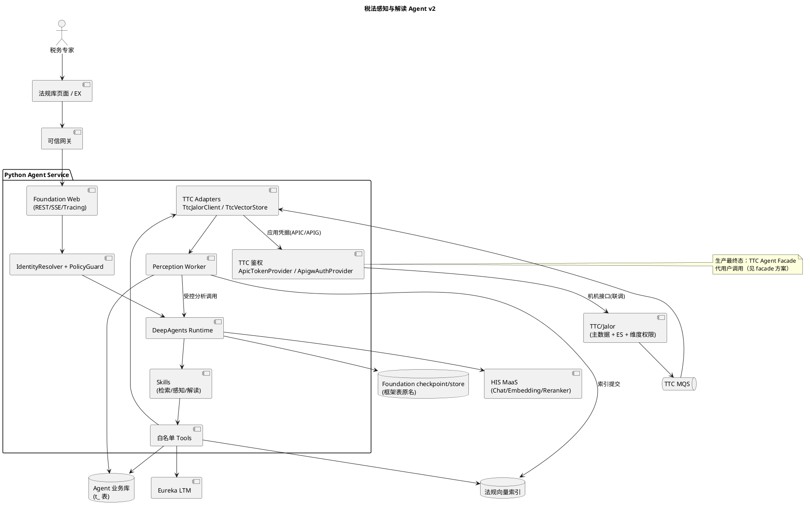
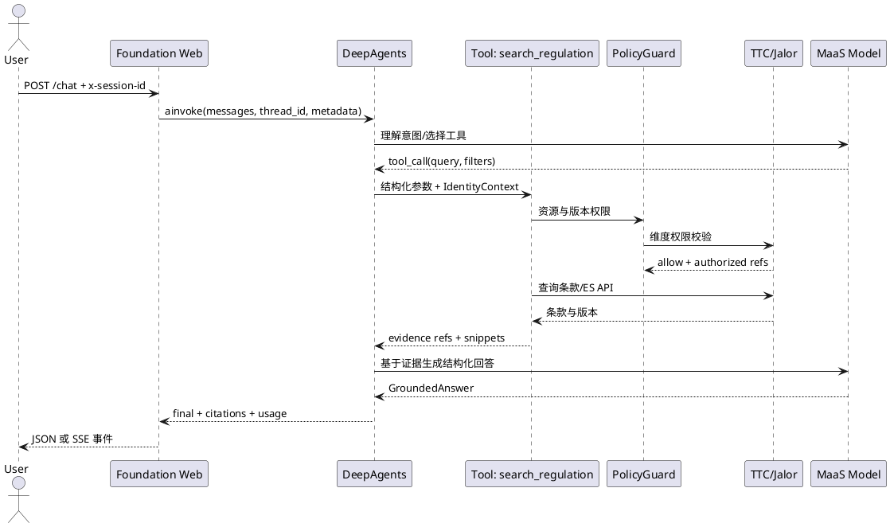
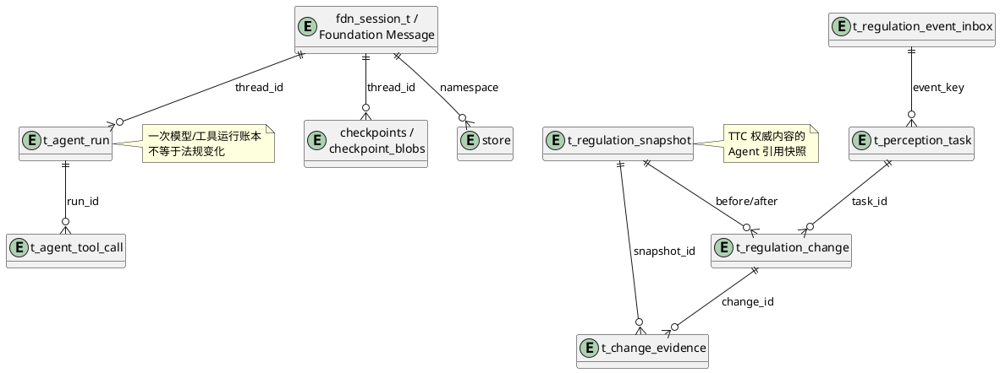

# 税法感知与解读 Agent v2 技术方案

版本：2.0（Foundation/LLM 重建基线）  
日期：2026-09-15  
目标：以独立 Python Agent Service 为交付单元，在 2026 年 12 月接入法规库页面；Demo 和测试环境先验证大模型对话、法规检索、变化感知和专家复核闭环。

本文是在旧版方案基础上的重审版本。旧版已经完成的 TTC HTTP、API 降级、领域模型和测试代码保留为迁移参考；新版主服务必须以 Eureka X Foundation Web、DeepAgents Runtime 和 MaaS 模型为核心，不能以固定规则或固定文本代替 Agent。

## 目录

- [1. 重审结论与目标](#s1)
- [2. 范围、原则与分期](#s2)
- [3. 技术栈与运行时](#s3)
- [4. 总体架构与数据流](#s4)
- [5. Agent、Skill 与 Tool 设计](#s5)
- [6. TTC、RAG 与感知工作流](#s6)
- [7. 数据归属、表结构与 ER 图](#s7)
- [8. API、流式协议与错误处理](#s8)
- [9. 身份、鉴权与租户隔离](#s9)
- [10. 记忆、检查点与可观测性](#s10)
- [11. 部署、容量与安全边界](#s11)
- [12. 验收标准与风险门](#s12)
- [13. 资料依据](#s13)

<a id="s1"></a>

## 1. 重审结论与目标

### 1.1 对旧版的修正

旧版先实现 HTTP、数据库和确定性服务，模型只作为后续适配器，导致 codebase 不是可运行的 LLM Agent。v2 作出以下硬修正：

1. **Foundation/LLM 是 Phase 0/1 的硬前置。** 必须先验证内部 SDK、模型创建、`agent.ainvoke` 和 `agent.astream_events`，再扩展业务工具。
2. **Runtime 是业务编排中心。** 使用 `deepagents.create_deep_agent` 生成 `CompiledStateGraph`；查询理解、工具选择、摘要和解读由模型完成，权限、幂等、差异、审核和写操作由代码强制完成。
3. **模型不可用不能静默降级为假 Agent。** 健康检查可以在未配置模型时启动，但 `/chat` 明确返回 `MODEL_UNAVAILABLE`；本地规则检索只能作为工具测试或感知 API 降级，不能伪装成自然语言 Agent。
4. **Session/Message/Checkpoint/Store 优先使用 Foundation。** 自建表不复制 Foundation 状态格式，只保存业务运行态、证据和审核资产。
5. **旧 `app/` 暂不作为新主服务。** 新基线使用 `src/`，待 Foundation 最小纵向闭环通过后再迁移旧适配器并删除重复实现。

### 1.2 业务目标

- 法规检索：用户用自然语言提问，Agent 改写查询、选择关键词/向量工具、校验权限，返回带 TTC 版本和条款位置引用的结构化回答。
- 法规感知：接收 TTC MQ 事件；无 MQ 权限时使用显式的 API 对账模式，获取前后版本，生成变化摘要、影响候选和专家审核任务。
- 解释与追溯：所有法规事实都能回到 `source_system/source_id/source_revision/chunk_id/locator/content_hash`；不允许无证据的确定性税务结论。
- 运行可恢复：同一 `x-session-id` 映射 Foundation `thread_id`，长任务使用 checkpoint 恢复；跨会话偏好使用 Foundation Store/LTM，并按用户和租户隔离。

### 1.3 非目标

本期不自动修改 TTC 主数据、计税规则或审批结果；不新建外部爬虫；不让模型决定目标 URL、数据库 SQL、用户身份、通知收件人或权限；不把隐藏思维链写入响应、日志或数据库。

<a id="s2"></a>

## 2. 范围、原则与分期

### 2.1 不可变原则

| 原则            | 具体约束                                                     |
| --------------- | ------------------------------------------------------------ |
| LLM first       | 每个对话请求都进入真实模型 Runtime；没有模型配置时返回可诊断错误 |
| 工具白名单      | 模型只能调用注册的法规检索、版本、实体和影响工具；工具参数由 Pydantic 校验 |
| 权限前置        | `IdentityContext` 由可信网关/认证适配器产生，工具和仓储不接受客户端 user/tenant 覆盖 |
| 事实可引用      | 法规事实必须有完整证据引用和内容 hash；引用校验失败则降级为“无法确认” |
| TTC 主数据      | 法规业务主表、ES 和维度权限归 TTC；Agent 不直连 TTC 数据库   |
| Foundation 状态 | Session、Message、Checkpoint、Store、LTM 使用 Foundation；业务表统一 `t_` 前缀 |
| 事件可重放      | MQ 消息和 API 对账都先写 Inbox，再以业务键幂等处理；无游标 API 不宣称可靠增量 |
| 可审计写入      | 任务状态、审核、通知和工具调用保留操作人、trace、版本和结果 hash |

### 2.2 分期边界

| 阶段     | 必须交付                                                     | 可以延后                                      |
| -------- | ------------------------------------------------------------ | --------------------------------------------- |
| Demo     | Foundation Web、真实 MaaS 模型、DeepAgents、`/chat`/SSE、3 个检索工具、受控样本、7 张核心 `t_` 表、API 感知降级、专家审核数据 | MQ 权限、LTM 生产接线、通知发送、全量向量索引 |
| 首期生产 | MQ Consumer、TTC Facade/正式鉴权、OpenGauss checkpoint/store、法规向量索引、任务恢复、通知幂等 | 自动订阅、复杂反馈学习、跨源知识图谱          |
| 后续增强 | LTM 提取策略、reranker、多模型路由、订阅与通知偏好、评测闭环、容灾和多副本租约 | 不改变主数据归属和权限边界                    |

没有 MQ 消费权限时，`FEED_MODE=api` 必须显式显示在运行指标和管理接口中；API 扫描只用于 Demo/对账，不能替代生产事件保证。

<a id="s3"></a>

## 3. 技术栈与运行时

### 3.1 版本基线

| 组件          | 基线                                                         | 用途                                       |
| ------------- | ------------------------------------------------------------ | ------------------------------------------ |
| Python        | 3.12.x                                                       | 运行时和类型检查                           |
| Foundation    | `hw-finance-agentframework==1.0.3.dev5`（以环境批准锁定版本为准） | Eureka X Web、配置、鉴权、观测和客户端适配 |
| Agent Runtime | `deepagents.create_deep_agent`、LangGraph                    | Skill、Tool、checkpoint 和流式事件         |
| Model         | `eurekax.openai_compatible.ChatOpenAICompatible`             | 调用 HIS MaaS OpenAI-compatible 接口       |
| Web           | `pyxis.app_factory.create_app` + FastAPI/ASGI                | 中间件、健康检查和 REST/SSE                |
| Config        | `pyxis.config_loader.ConfigLoader`                           | 配置中心、账号和 RDB 动态凭据              |
| State         | `eurekax.langgraph_opengauss.OpenGaussAsyncSaver/OpenGaussAsyncStore` | 线程状态和跨线程 Store                     |
| HTTP/MQ       | `httpx`、Foundation MQS Client                               | TTC API、MCP/模型和消息消费                |
| DB driver     | `psycopg[binary]`、`opengauss-sqlalchemy`                    | OpenGauss 连接                             |
| Test          | `pytest`、`pytest-asyncio`、`ruff`、`mypy`                   | 单测、契约测试和静态检查                   |

内部包无法从当前网络或镜像安装时，Phase 0 只能记录阻塞并验证端口契约；禁止自定义一个名为 `deepagents` 或 `eurekax` 的假 Runtime 进入主代码。

### 3.2 Agent 创建与配置

配置文件采用模板项目的分环境 TOML：`src/config/LOCAL.toml`、`DEV-ADS.toml`、`DEV-AIF.toml`、`PROD-ADS.toml`、`PROD-AIF.toml`。密钥只引用 ConfigCenter/J2C 账号名，不进入仓库。

核心工厂的确定性接口如下（具体 SDK 参数以安装版本类型检查结果为准）：

```python
async def create_tax_agent(
    *,
    checkpointer: BaseCheckpointSaver | None,
    store: BaseStore | None,
    tools: Sequence[BaseTool],
    skills_dir: str,
    system_prompt: str,
) -> CompiledStateGraph:
    model = ChatOpenAICompatible(
        model=settings.model.name,
        api_key=config_loader.get_account(settings.model.auth_account)["password"],
        base_url=config_loader.get_kv_configs_simple()[settings.model.url_key] + "/v1",
        http_async_client=httpx.AsyncClient(
            trust_env=False, verify=False, timeout=settings.model.timeout_seconds,
            headers={"x-reasoning-format": "reasoning"},
        ),
        extra_body=settings.model.extra_body,
    )
    return create_deep_agent(
        model=model,
        tools=list(tools),
        system_prompt=system_prompt,
        skills=[skills_dir],
        checkpointer=checkpointer,
        store=store,
        middleware=[DisableBuiltinTools()],
    )
```

工厂必须在启动时验证模型名、URL key、账号名和超时；不得在导入模块时访问网络。`MODEL_ENABLED=false` 时只允许启动 health/metrics 和管理诊断接口，聊天路由返回 HTTP 503。

### 3.3 Runtime 生命周期

1. `main.py` 通过 `create_app` 创建 Foundation Web 应用并注册 tracing、异常和鉴权中间件。
2. lifespan 打开 `OpenGaussAsyncSaver`、`OpenGaussAsyncStore`，执行部署阶段完成的 schema 版本检查，不在每次启动执行破坏性 migration。
3. `AgentFactory` 按请求或受控缓存构造 Agent；模型、工具和 Skill 版本写入 `t_agent_run`。
4. `/chat` 使用 `await agent.ainvoke(...)`；`/chat/stream` 使用 `agent.astream_events(..., version="v2")`。
5. 关闭时通过 `AsyncExitStack` 释放 HTTP、数据库和 MQ 连接。

<a id="s4"></a>

## 4. 总体架构与数据流

### 4.1 分层职责

| 层     | 模块                                     | 职责                                                 |
| ------ | ---------------------------------------- | ---------------------------------------------------- |
| 接入   | Foundation Web、REST、SSE、EX Adapter    | DTO 校验、trace/session 解析、错误映射               |
| 上下文 | `IdentityResolver`、`PolicyGuard`        | 可信身份、租户/业务环境、资源权限                    |
| Agent  | DeepAgents Runtime、Query Router、Skills | 意图理解、工具选择、结构化解读                       |
| Tool   | `tools/regulation_*`                     | 只读检索、快照、diff、实体和影响候选；无任意网络/SQL |
| 工作流 | `PerceptionWorkflow`、`ReviewWorkflow`   | 事件幂等、质量门禁、审核状态和重试                   |
| 领域   | Evidence、Revision、Task、Run            | hash、版本、状态机和业务规则                         |
| 适配器 | TTC、MQS、OpenGauss、Vector、LTM         | 对外协议和存储实现，不能向上泄露 SDK 类型            |

### 4.2 总体架构图



### 4.3 查询时序



<a id="s5"></a>

## 5. Agent、Skill 与 Tool 设计

### 5.1 Skill 文件

每个 Skill 是可版本化的 `SKILL.md`，由 Runtime 发现，不包含凭据、SQL、HTTP URL 或隐藏推理。首期固定三个 Skill：

| Skill                       | 触发场景                       | 输出                                   |
| --------------------------- | ------------------------------ | -------------------------------------- |
| `regulation_retrieval`      | 查找法规、条款、案例、适用条件 | `GroundedAnswer`、候选条款、建议检索词 |
| `regulation_perception`     | 解释新增/修订/废止变化         | `ChangeAnalysis`、影响候选、证据列表   |
| `regulation_interpretation` | 对已授权条款进行业务化解读     | 适用条件、例外、待确认问题、引用       |

Skill 要求模型先确认用户意图和显式过滤条件，再调用工具；工具返回空结果时解释过滤条件和数据时点；模型不得把用户输入中的身份字段写入工具上下文。

### 5.2 白名单 Tool

| Tool                          | 输入                                           | 输出与确定性边界                                             |
| ----------------------------- | ---------------------------------------------- | ------------------------------------------------------------ |
| `search_regulation_keyword`   | `keyword`、TTC 过滤字段、`limit`               | 调用 TTC ES/分页 API；返回已授权 `EvidenceRef`，不生成摘要   |
| `search_regulation_vector`    | `query`、`corpus_scope`、`as_of_date`、`limit` | embedding + 向量召回；强制租户/环境/版本过滤，返回 chunk 和分数 |
| `fetch_regulation_snapshot`   | `source_id`、`source_revision`                 | 从 TTC 获取原文或快照；校验 content hash 和权限              |
| `compare_regulation_versions` | `before_ref`、`after_ref`                      | 代码执行段落级 diff、增删统计和 hash；模型只解释结果         |
| `extract_tax_entities`        | 已授权文本片段                                 | 模型结构化抽取税种、辖区、日期、主体；不访问外部系统         |
| `assess_business_impact`      | 变化证据、受影响业务域                         | 模型给出候选影响与置信度，结果必须标记“待专家确认”           |

所有工具返回统一的 `ToolResult {status, data, evidence, warnings, trace_id}`。失败分为 `AUTH_DENIED`、`UPSTREAM_UNAVAILABLE`、`INVALID_INPUT`、`NO_EVIDENCE`、`MODEL_UNAVAILABLE`；工具不得捕获后返回空字符串。

### 5.3 LLM 与确定性代码边界

| 能力                     | LLM          | 确定性代码                             |
| ------------------------ | ------------ | -------------------------------------- |
| 查询理解、改写、工具选择 | 负责         | 校验 schema、过滤白名单                |
| 检索与权限               | 不负责       | TTC/Vector 查询、PolicyGuard、租户隔离 |
| 变化识别                 | 辅助解释     | hash、版本排序、段落 diff              |
| 实体和影响               | 结构化候选   | 字段校验、置信度阈值、人工状态         |
| 运行状态                 | 不可修改     | Run/Task 状态机、幂等、重试、审计      |
| 通知/主数据写入          | 不可直接调用 | 审核通过后由服务账号执行、幂等键约束   |

<a id="s6"></a>

## 6. TTC、RAG 与感知工作流

### 6.1 TTC API 适配

首期使用已核实并实测通过的接口（SIT 直连必须带 `publicservices` 段，否则报 `resource group cannot be found`）：

```text
POST {base_url}/fin/ttc/publicservices/taxRegulation/taxClause/queryTtcClauseDataList/page/{pageSize}/{curPage}
```

实测基址：
- APIC 直连：`https://ttc.hissit.huawei.com`（动态 token，`{"keyWord":"增值税"}` → 256 条）
- APIG 网关：`https://apigw-beta.huawei.com/api/uat`（静态 AK/SK，`{"keyWord":"增值税"}` → 42 条）

请求 body 严格对应 TTC `ExtClauseQueryParam`，只能出现以下 11 个字段：

```json
{
  "keyWord": "",
  "tlpNumber": "",
  "taxJurisdictionCodeList": [],
  "taxJurisdictionProvinceCodeList": [],
  "regionCodeList": [],
  "taxCategoryCodeList": [],
  "taxTypeCodeList": [],
  "taxElementL1CodeList": [],
  "taxElementL2CodeList": [],
  "orderBy": "",
  "orderDesc": ""
}
```

`pageSize` 和 `curPage` 只在路径中传递。响应只依赖 `pageVO.totalRows/curPage/pageSize` 和 `result[]` 中的 `cmplTlpId/tlpNumber/tlpContent/tlpStatus/version`。DTO 使用 `extra="forbid"` 保护请求，`extra="ignore"` 兼容响应新增字段。错误响应保留 TTC `status/code/message/data` 并映射为适配错误。

**当前实现状态（2026-09-16 已落地）**：
- `src/adapters/ttc/http_client.py` — `TtcClauseHttpClient`（`publicservices` 路径、`auth`/`trust_env`/`verify_tls`/`fork` 支持）
- `src/adapters/ttc/jalor.py` — `TtcJalorClient` 实现 `JalorClient` 端口，映射 `EvidenceCandidate`
- `src/adapters/ttc/vector.py` — `TtcVectorStore` 实现 `VectorStore` 端口（TTC 结果本地 token 打分，真实 TTC 未暴露语义向量接口）
- `src/application/container.py` — `for_ttc()` 用 `fork()` 独立连接池装配 keyword/vector 检索
- `src/main.py` — lifespan 检测到 `registry.ttc` 时自动 wiring 真实 TTC 工具链
- 鉴权：`src/adapters/auth/apic_token.py`（APIC 动态 token）+ `apigw_auth.py`（APIG 静态 AK/SK），由 `RESOURCES.ttc.auth_kind` 选择
- 验证脚本：`scripts/ttc_verify.py`（`--auth apic|apigw`）

Agent 不直连 TTC 数据库或 ES；正式鉴权优先由 TTC Agent Facade 提供窄接口（见 `docs/guides/ttc-facade-integration-plan.md`），Demo 联调使用 APIC/APIG 应用凭据直连 SYSTEM 机机接口（无用户维度，仅限测试环境）。Jalor 维度权限仍由 TTC 执行，Agent 只缓存短时授权结果且权限失败时不使用旧缓存。

### 6.2 RAG 检索链路

1. 通过 TTC API/MQ 获取已发布或“待审核”快照，规范化为 chunk，记录来源、版本和 hash。
2. Embedding 服务生成向量，索引 manifest 保存模型版本、维度、分块规则和构建批次。
3. 查询时并行调用 TTC 关键词和向量检索，按 `source_revision`、生效日期、资源权限过滤，再由 reranker（可选）排序。
4. 只把授权片段交给模型；输出 `GroundedAnswer` 前由 `EvidenceValidator` 检查每个事实都有 citation。
5. 向量索引是可重建投影，TTC 主数据变化或 ACL 撤销时标记失效并异步重建。

### 6.3 法规感知工作流

```text
MQ/API -> t_regulation_event_inbox (幂等) -> t_perception_task
       -> fetch snapshot -> compare versions -> LLM change analysis
       -> quality gate -> t_regulation_change + t_change_evidence
       -> PENDING_REVIEW -> expert approve/reject -> optional notify/index
```

MQ 事件的业务键为 `source_system + source_id + source_revision + event_type`，不能使用 TTC Producer 的毫秒 `businessId` 作为版本号。API 降级模式使用固定时间窗口和重叠页扫描，记录扫描水位和对账结果；因 TTC 分页接口无增量游标，必须把重复、遗漏风险报告为运行指标。

质量门禁至少检查：新旧版本存在、hash 可计算、diff 非空或明确为元数据变化、引用完整、模型输出符合 JSON Schema、影响结果带置信度和审核状态。门禁失败进入 `NEEDS_REVIEW`，不推送默认已发布结论。

<a id="s7"></a>

## 7. 数据归属、表结构与 ER 图

### 7.1 表边界结论

TTC 继续拥有法规主数据、版本发布、ES 索引和维度权限。Agent 不复制 TTC 的法规业务表，不与 TTC 库做跨库 JOIN。Agent 只持久化运行所需的引用、快照、变化分析和任务状态；法规正文可按保留策略放对象存储，关系库保存 hash 和定位信息。

Foundation 负责的表沿用框架命名，不加 `t_`：

| Foundation 表/能力                                           | 业务定位                                  | Demo 是否启用                      |
| ------------------------------------------------------------ | ----------------------------------------- | ---------------------------------- |
| `checkpoints`、`checkpoint_blobs`、`checkpoint_writes`、`checkpoint_migrations` | 同一 `thread_id` 的消息、图状态和中断恢复 | 是，`/chat` 必须启用               |
| `store`、`store_migrations`                                  | 跨会话命名空间数据和 Agent 长期状态       | Demo 可启用最小读写                |
| `store_vectors`、`vector_migrations`                         | Foundation Store 的语义检索（若版本支持） | 后置，法规索引先用独立 VectorStore |
| `fdn_session_t` 及 Foundation Session/Message                | 会话、消息、用户绑定                      | 是，避免自建重复表                 |

### 7.2 自建 `t_` 表及业务定位

| 表名                       |           Demo | 业务定位                                                     | 关键字段                                                     |
| -------------------------- | -------------: | ------------------------------------------------------------ | ------------------------------------------------------------ |
| `t_agent_run`              |           必须 | 一次用户对话或后台 Agent 调用的账本，用于状态、模型版本、质量/成本和审计；不是一次“业务变化”本身 | `run_id`、`thread_id`、`tenant_id`、`actor_id`、`run_type`、`status`、`model_name`、`prompt_version`、`input_hash`、`usage_json`、`trace_id` |
| `t_agent_tool_call`        |           必须 | 记录每次模型工具调用的参数摘要、开始/结束时间、结果状态和证据数量，用于重放、计费和排障；不存隐藏思维链和敏感原文 | `tool_call_id`、`run_id`、`tool_name`、`args_hash`、`status`、`latency_ms`、`evidence_count`、`error_code` |
| `t_regulation_event_inbox` | 感知 Demo 必须 | MQ 或 API 扫描收到的原始事件去重账本，保证至少一次投递可重放；不是 TTC 主数据表 | `event_key`、`source_id`、`source_revision`、`event_type`、`payload_hash`、`received_at`、`process_status` |
| `t_perception_task`        | 感知 Demo 必须 | 把 Inbox 事件变成可调度、可租约、可审核的感知任务，保存重试和质量门禁状态 | `task_id`、`event_key`、`task_type`、`status`、`lease_owner`、`attempts`、`next_retry_at`、`review_status` |
| `t_regulation_snapshot`    | 感知 Demo 必须 | 保存 TTC 版本快照的元数据和可追溯正文位置，为 diff、RAG 重建和审核提供稳定引用；不是法规权威主表 | `snapshot_id`、`source_id`、`source_revision`、`content_uri`、`content_hash`、`effective_from`、`effective_to`、`visibility_scope` |
| `t_regulation_change`      | 感知 Demo 必须 | 保存一次新旧版本之间的结构化变化结果和 LLM 解读，用于专家审核页面和检索解释 | `change_id`、`before_snapshot_id`、`after_snapshot_id`、`change_type`、`summary_json`、`impact_json`、`confidence`、`review_status` |
| `t_change_evidence`        | 感知 Demo 必须 | 把变化结论与原文 chunk 建立多对多证据关系，支持逐条引用和 hash 校验 | `change_id`、`snapshot_id`、`chunk_id`、`locator`、`content_hash`、`evidence_role` |

后置表及定位：`t_notification_delivery`（审核后通知幂等账本）、`t_agent_feedback`（专家采纳/纠错）、`t_index_job`（向量索引构建）、`t_subscription`（订阅偏好）、`t_audit_event`（合规审计扩展）。它们不阻塞检索和感知 Demo。

### 7.3 Demo 最小集合

只做法规检索 Demo 时，必须有 `t_agent_run`、`t_agent_tool_call`；Foundation Session/Message/Checkpoint 表由框架迁移。加入法规感知 API 降级闭环后，再启用其余 5 张表。通知、反馈、订阅、索引作业表放到首期生产或后续增强。

### 7.4 ER 图



自建表全部包含 `created_at/updated_at`、`tenant_id`（适用时）、`trace_id` 和版本字段；跨租户查询必须在 SQL 条件和应用 `PolicyGuard` 双重约束。Foundation 表由其 migration 管理，不在业务 migration 中重建。

<a id="s8"></a>

## 8. API、流式协议与错误处理

### 8.1 对话接口

```http
POST /api/v1/agent/chat
x-session-id: <session-id>
x-tracerid: <trace-id>
Content-Type: application/json
```

```json
{
  "message": "请解释该条款对跨境服务的适用条件",
  "client_message_key": "client-generated-idempotency-key",
  "filters": {"jurisdiction": "CN", "as_of_date": "2026-09-15"}
}
```

响应为结构化 `ChatResponse`：`run_id`、`session_id`、`status`、`answer`、`citations`、`suggested_terms`、`warnings`、`usage`。`answer` 只包含最终可展示文本和结构化字段；不返回 reasoning 字段。

`POST /api/v1/agent/chat/stream` 使用 `text/event-stream`。事件白名单：`meta`、`progress`、`tool_call`、`evidence`、`delta`、`final`、`error`。事件包含 `run_id`、`trace_id` 和序号；断线可使用同一 `x-session-id` 重连并从 checkpoint 恢复。模型异常在流已开始后发送 `error` 事件，HTTP 状态不能再修改。

### 8.2 感知和管理接口

- `POST /api/v1/agent/perception/reconcile`：仅服务身份调用，触发受限时间窗口 API 对账。
- `GET /api/v1/agent/perception/tasks/{task_id}`：返回当前用户/租户有权限的任务。
- `POST /api/v1/agent/perception/tasks/{task_id}/review`：专家提交 `APPROVE/REJECT/REQUEST_CHANGES`，带幂等键和版本号。
- `GET /actuator/health`：返回基础进程状态；模型、TTC、MQ 和 DB 状态分项显示，不把外部短暂故障伪装为整体成功。

### 8.3 错误码

|    HTTP | code                                       | 含义                             | 客户端动作              |
| ------: | ------------------------------------------ | -------------------------------- | ----------------------- |
|     400 | `INVALID_INPUT`                            | 请求或工具参数不合法             | 修正请求                |
|     401 | `UNAUTHENTICATED`                          | 无可信身份                       | 重新登录/由网关补充身份 |
| 403/404 | `ACCESS_DENIED`                            | 无资源权限；查询资源时可统一 404 | 不重试权限请求          |
|     409 | `IDEMPOTENCY_CONFLICT`                     | 同一幂等键内容不同               | 使用新 key 或查询原 run |
|     422 | `OUTPUT_NOT_GROUNDED`                      | 模型输出缺少证据或 schema 错误   | 展示待确认状态          |
|     429 | `MODEL_RATE_LIMITED`                       | 模型限流                         | 按 Retry-After 重试     |
|     503 | `MODEL_UNAVAILABLE`/`UPSTREAM_UNAVAILABLE` | 模型、TTC、MQ 暂不可用           | 有界重试或转人工        |

<a id="s9"></a>

## 9. 身份、鉴权与租户隔离

### 9.1 入站身份

Foundation Web 的认证中间件验证网关 token，解析为不可变 `IdentityContext`：

```python
IdentityContext(
    global_user_id: str,
    tenant_id: str,
    biz_env_id: str,
    actor_type: Literal["USER", "SERVICE"],
    scopes: frozenset[str],
    trace_id: str,
)
```

请求体中的 `globalUserId/tenantId/bizEnvId` 一律视为普通文本，不能覆盖上下文。服务身份只允许调用对账、消费和审核后的通知接口，并通过 scope 白名单控制。

### 9.2 出站 TTC 鉴权

法律评审 Agent 的 HS512 自签 `x-jwt-ms-token` **对 TTC 无效**（TTC 由 IAM SDK 远程公钥验签，不认自签），已弃用。实测验证 TTC 接受两条应用凭据链路：

| 链路            | 凭据                                                         | 地址                            | 适配器                            |
| --------------- | ------------------------------------------------------------ | ------------------------------- | --------------------------------- |
| APIC 动态 token | `subjectCode + static_secret` 换 token → `Authorization: Basic base64(appId:token)` | `ttc.hissit.huawei.com`         | `src/adapters/auth/apic_token.py` |
| APIG 静态 AK/SK | `X-HW-ID`（appId）+ `X-HW-APPKEY`（AK）                      | `apigw-beta.huawei.com/api/uat` | `src/adapters/auth/apigw_auth.py` |

两者都是**应用身份**（机机调用）：TTC 通过后建立 `Virtual` 虚拟用户，**不携带浏览器用户委托**，SYSTEM 机机接口不做用户数据维度过滤。因此**仅限本地/测试联调**。

生产仍须满足设计约束：每次 TTC 请求传递 `trace_id`、调用方服务身份和必要的用户委托信息；TTC 继续执行原有维度权限。正式方案见 `docs/guides/ttc-facade-integration-plan.md`（TTC Agent Facade 代用户调用）。Agent 只缓存经过授权的证据，缓存键必须包含租户、业务环境、用户 scope 和版本；权限失败不得回退到未授权缓存。

### 9.3 安全要求

- 日志只记录 args/result hash、ID、状态和延迟；法规正文、token、prompt secret 和思维链脱敏。
- Tool 不能访问任意 URL、文件系统、shell 或 SQL；所有外部地址来自服务端配置白名单。
- LTM namespace 使用 `("tax-law-agent", tenant_id, global_user_id)`，服务身份和用户记忆分离；删除用户时执行 Foundation Store/LTM 删除和向量索引撤销。

<a id="s10"></a>

## 10. 记忆、检查点与可观测性

### 10.1 短期状态

`thread_id = x-session-id`。Foundation checkpoint 保存消息、工具调用状态和中断恢复所需图状态；`t_agent_run` 只保存运行账本和可审计摘要。恢复时必须再次解析身份并校验 thread 所属租户，不能仅凭客户端 session ID 读取。

### 10.2 长期记忆

Foundation Store/LTM 保存用户明确偏好、常用税种和最近确认的检索词；法规事实不写入个人记忆。LTM 提取必须经过字段分类、敏感信息过滤和租户 namespace 校验。显式查询条件优先级高于记忆推荐，专家纠错可删除或覆盖旧记忆。

### 10.3 观测指标

记录 `run_id/trace_id/model_name/prompt_version/tool_name`，并统计：模型首 token 延迟、总延迟、token 用量、工具成功率、TTC 5xx、MQ lag、Inbox 重复率、diff 失败率、引用完整率、专家采纳率和模型不可用次数。Langfuse/平台观测只接收脱敏 metadata，不上传完整涉税正文。

<a id="s11"></a>

## 11. 部署、容量与安全边界

Demo 单实例可使用本地或测试 OpenGauss、受控样本向量文件和 API 对账；生产至少两副本，Worker 使用任务租约避免重复分析。模型、TTC、MQ、DB 的连接池、超时、重试和熔断均配置化。

容量估算以 5000+ 年变化为基线：按每条变化 2 个版本、平均 8 个 chunk、保留 3 个分析版本估算快照和证据；向量索引按 embedding 维度和副本数单独评估。上线前必须用真实脱敏样本验证 P95 延迟、模型并发、TTC 限流和 OpenGauss checkpoint 写入吞吐。

删除、撤销和 ACL 变更必须产生事件或对账记录，撤销后的证据不可继续进入模型上下文。通知发送采用后置 `t_notification_delivery` 和幂等 key，不在 Demo 中绕过审核直接发送。

<a id="s12"></a>

## 12. 验收标准与风险门

### 12.1 Phase 0/1 必须通过

1. `uv sync` 能安装批准的 Foundation 版本，或明确记录内部包安装阻塞；不以假依赖替代。
2. `LOCAL.toml` 不含密钥；模型配置存在时，`/chat` 能得到真实 MaaS 回复，`/chat/stream` 能收到 `delta/final`。
3. 模型未配置时 health 可诊断，`/chat` 返回 `503 MODEL_UNAVAILABLE`，不会返回固定文本。
4. `x-session-id`、`x-tracerid`、IdentityContext 和 checkpoint/store 测试通过；跨租户读取失败。
5. 工具调用只在白名单内，结构化输出和 citation validator 测试通过。

### 12.2 感知 Demo 必须通过

1. TTC API body/路径/响应严格符合 `ExtClauseQueryParam` 和 `PagedResult` 契约。
2. API 降级模式能产生 Inbox、Task、Snapshot、Change 和 Evidence，并可重复执行不重复生成结果。
3. diff、hash、引用、质量门禁和专家审核状态可追踪；模型失败进入可重试或人工状态。
4. 页面能展示变化前后、摘要、影响候选、证据位置和“待确认”标识。

### 12.3 阻塞规则

- Foundation SDK、MaaS endpoint 或批准账号未获得时，停止进入模型纵向开发，只完成契约测试和配置诊断。
- TTC 未提供可验证的用户级权限/Facade 时，不进入生产接入；测试只能使用隔离临时 JWT。
- MQ 未授权时可交付 API Demo，但必须将运行模式、遗漏风险和补偿扫描记录在指标和验收报告中。

<a id="s13"></a>

## 13. 资料依据

- `REQUIREMENTS.md`：业务目标、技术约束和 PlantUML 要求。
- Eureka X Foundation 模板：`C:/Workspace/EurekaX相关资料/示例代码仓/eurekax.foundation.template`，重点参考 `pyproject.toml`、`main.py`、`src/utils/config_loader.py`、`src/agent/service.py`、`src/agent/router.py`。
- Foundation 文档：Agent 构建、OpenGauss checkpoint/store、长期记忆、多用户隔离、MQS、Web 和鉴权章节。
- TTC 源码：`TaxClauseMessageProducer`、`ExtClauseQueryParam`、`TaxClauseController`、`DimensionPermissionAbility` 及现有原文/修订集成处理器。
- 法律评审 Agent：请求级身份、Jalor HS512 临时客户端及鉴权评审记录。
- 智能风控 Agent：Skill 工作流、并发上下文、会话和输出仓储的分工方式。

本方案中的新接口、表和目录是 Agent Service 的设计契约，不表示 TTC 或 Foundation 已经部署；实施计划中的验证门负责把设计契约转换为真实环境结论。