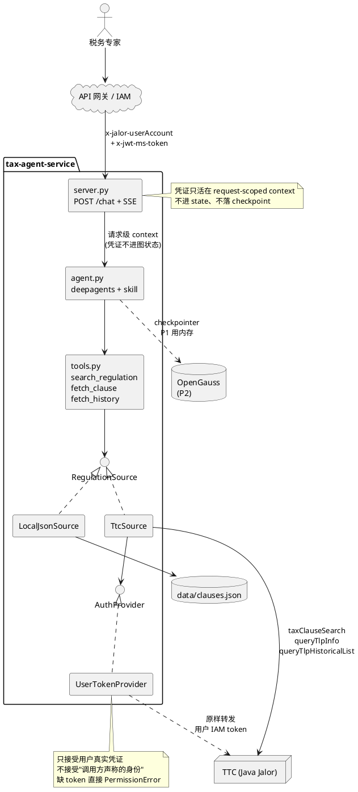

# 税法检索与解读 Agent — P1 重建计划

> 2026-09-19。取代 `2026-09-15-tax-law-agent-v2-design.md` 中与鉴权、数据源、阶段划分相关的部分。
> 本仓是干净房间重建：内网已有可运行版本，此处只迁移结论、不迁移代码。

## 1. 已锁定的决策

| 议题 | 决策 | 理由 |
|---|---|---|
| 鉴权 | **只透传用户 IAM token** | TTC 确认 APIC 应用级凭证调不了 `taxClauseSearch`(`SYSTEM`) 与 `queryTlpInfo`(`READ`)，应用级兜底这条路不存在 |
| 用户标识 | 网关透传头 **`x-jalor-userAccount`** | TTC 认的是网关构造的 `UserVO`，不是 JWT 里某个 claim；解 claim 只作无网关头时的退路 |
| 自签 JWT | **排除** | TTC 不认自签。隔壁 LegalReviewAgent 能用是其后端走共享密钥 HMAC，体系不同 |
| 数据权限 | **完全委托 TTC**，不自建权限层、不预建索引、不跨用户缓存检索结果 | 保证"Agent 不让你看到页面上看不到的东西" |
| 调用哪些接口 | **与法规库前端页面一致** | 页面调什么我们调什么，权限语义自动对齐，无需假设 TTC 的过滤实现 |
| P1 交付形态 | HTTP 服务（`/chat` + SSE），CLI 退化为客户端 | 用户身份只能从 HTTP 请求进来，CLI 形态下这条链路不存在 |
| TTC 适配器 | 现在写完 + 离线契约测试，内网只做联调 | 内网调试成本最高，不该花在"我解析写错了"上 |
| P1 范围 | 仅检索与解读 | 感知 / MQ / 专家审核整块推二期 |

## 2. 架构



`RegulationSource` 两个实现（本地样本 / TTC）；`AuthProvider` 只剩一个实现——TTC 确认 APIC
凭证调不了我们的两个接口，无用户身份的场景该用 `LocalJsonSource`，不是退到公有 API。

**凭证纪律**：token 只活在请求级 context（`config["configurable"]`，**不进 state**）。checkpointer 二期换 OpenGauss 后会落盘，token 一旦进图状态就等于写进对话记录并回灌给模型。

**Confused deputy 防线**：只接受调用方转发的**用户真实凭证**，不接受"调用方声称用户是谁"。后者（隔壁 EX 平台把 `globalUserId` 放 body 的做法）意味着任何能访问 Agent 的人都能冒充任意用户。

## 3. 工具 → TTC 接口映射

| 工具 | TTC 接口 | 路径 | 入参 / 返回 |
|---|---|---|---|
| `search_regulation` | `taxClauseSearch` | `POST /taxClause/taxClauseSearch/page/{pageSize}/{curPage}` | `TaxClauseSearchParam` → `TaxClauseSearchVO` |
| `fetch_clause` | `queryTaxClause` | `POST /taxClause/queryTlpInfo` | `TaxClauseParam` → `ResultInfo<TaxClauseVO>` |
| `fetch_history` | `queryTlpHistoricalList` | `POST /taxClause/queryTlpHistoricalList/page/{pageSize}/{curPage}` | `TcCmplTlpQueryParam` → `PagedResult<TaxClauseVO>` |
| （本地/开发回退） | `queryTtcClauseDataList` | `POST /fin/ttc/publicservices/taxRegulation/taxClause/queryTtcClauseDataList/page/{pageSize}/{curPage}` | 11 字段 `ExtClauseQueryParam`，公有 API，APIC 可调 |

选 `taxClauseSearch` 的理由：它是条文搜索页的前端主入口，且带 `keyword` ES 检索、`taxElementL1/L2/L3Code` 税务要素聚合、`taxJurisdictionCodeList` / `taxCategoryCodeList` 筛选、生效日期区间——检索能力远强于公有 API 的无序分页。

**已知缺陷（不阻塞 P1.4，但是上线硬门禁）**：`taxClauseSearch` 链路**缺失维度过滤**（`taxClauseSearchESParamProcess` 未调 `getDimensionByType`，用户传入的 `taxJurisdictionCodeList` 原样透传到 ES），任意登录用户可查出无权限税地的已发布条文。**TTC 已确认属实并立项修复**（参考 `invokeClauseEsApi` 注入 `setJuDimension`），且纠正了我们"6 维度只管编辑权"的理解——**读取侧本来就该做维度过滤，严重性比我们原判断更高**。我们的处理是：不利用、不绕路、上报；透传用户身份使修复自动生效，无需改我们的代码。

**上线门禁**：上线前必须确认该修复已发布。若未发布，把 `search_regulation` 换到 `queryTlpListByES`（`queryTaxClauseByKeyWord`，`invokeClauseEsApi` 链路**今天就有** `setJuDimension`）。现在不换，是因为换过去要重新猜一遍另一个接口的契约——`TaxClauseParam` 吃 **`keyWord`**（大写 W），`TaxClauseSearchParam` 吃 `keyword`，响应包装也是另一种，而刚从 TTC 那里拿到的确认全是针对 `taxClauseSearch` 的。

**路径陷阱**：公有 API 路径必须带 `publicservices` 段，写成 `/fin/ttc/...` 会报 "resource group cannot not found"。

## 4. 证据模型

沿用 P0 已验证的形状，与 TTC 字段同构：

| 我们的字段 | TTC 来源 |
|---|---|
| `clause_id` | `tlpNumber` 本身，如 `AD-ITX-CN-00275`——**不拼版本号** |
| `tlp_number` | `tlpNumber`（如 `AD-ITX-CN-00275`、`AD-TA-General-00652`——**段内可能混大小写**） |
| `revision` | `version` (Long，整数)，作为证据的独立属性返回，不进 `clause_id` |
| `clause_status` | `tlpStatus`(仅 DRAFT/RELEASED) + `archiveFlag`(Y→SUPERSEDED) + `effectiveState`(EXPIRING→REVOKED) |
| `content_hash` | `sha256(tlpContent)[:16]` |
| `effective_from` / `effective_to` | 同名字段 |

`TaxClauseVO` 约 90 字段，**必须投影到上述窄模型**再进模型上下文。旧内网代码已验证 90→5 的投影可行。

## 5. 阶段

### P1.0 — 本地可跑（已完成）
- `data/clauses.json`（17 条样本）、`src/tax_agent/tools.py`、`agent.py`、`skills/regulation-retrieval/SKILL.md`、`cli.py`
- 三个自检通过；三个真实模型场景验证通过（正常检索带引用 / 无依据不编造 / 已废止条款显著标注）
- **引用校验门禁**：答案中每个 `clause_id` 必须真实存在且本轮确实被工具返回过

### P1.1 — 抽出检索源抽象（已完成）
- 新增 `sources.py`：`RegulationSource`(Protocol) + `SearchResult`(NamedTuple) + `LocalJsonSource` + `content_hash`
- `tools.py` 降为薄封装，只负责参数透传和 `status` / `message` / `applied_filters` 外壳
- `known_clause_ids()` **故意不进协议**——接 TTC 后无法枚举整个法规库。引用校验里真正关键的是"引用了本轮未经检索的条款"，那道对任何检索源都成立
- 修 `agent.py` 直接当脚本跑时 `sys.path` 缺 `src/`（技能加载自检必须随手可跑）
- **`AuthProvider` 移到 P1.3**：它唯一的消费者是 `TtcSource`，提前写出来没人用也无法验证
- 验收结果：四个自检通过（sources / tools / citation audit / agent wiring），真实模型端到端问答引用正确、无校验告警；981 组参数组合逐一比对新旧返回值完全一致

### P1.2 — HTTP 服务与身份链路（已完成）
- 交付：`server.py`（`POST /chat` + SSE）、`identity.py`（token 解析 + contextvar）、`audit.py`（引用校验从 `cli.py` 抽出，服务端和 CLI 共用）；CLI 加 `--url` 走 HTTP
- 从 header 收 `x-jwt-ms-token`（缺失时不拒绝，`auth_mode="none"` 走 APIC）
- 绑定到请求级 contextvar，P1.3 由 `AuthProvider` 从这里取
- 接入 `eurekax.isolation.SessionManager` + `MemorySessionBinding`，`isolate_key` 取 token 里的用户账号
- 验收结果：
  - 传给图的 `config` 只有 `{"configurable": {"thread_id": ...}}`，断言原始 token 不出现在 `repr(config)` 中——全仓只有 `server.py` 一处构造 config
  - 无 token / 有 token 两条路径各跑通（stub 自检 + 真实模型端到端，引用校验 0 问题）
  - 用 lisi 的 token 带 zhangsan 的 `session_id` → 403
- 与原计划的偏差：
  - **不引 PyJWT**：我们不验签（网关和 IAM 验过，我们没有公钥），stdlib base64 解 payload 即可，与 TTC 自己的 `JwtRequestFilter` 下游做法一致
  - **claim 名未定**：`identity.py` 按 `uid` → `userAccount` → `sub` 取第一个非空，P1.4 拿到真实 token 后收敛
  - **新增 `sqlalchemy` 依赖**：`eurekax.isolation.__init__` 无条件 import `OpenGaussSessionBinding`，只用内存实现也躲不掉
  - **问答审计 JSONL（6.3）未做**：`/chat` 的 done 事件已经带齐全部字段（`session_id` / `auth_mode` / `tool_calls` / `citation_problems`），落盘等到真有人要查历史时再加
- 顺带修正两处：
  - 样本条款号原来是 `CN-VAT-0001@1.0`，与 TTC 真实 `tlpNumber` 不同构。已全库改为 `AD-VAT-CN-00001` 形态，`clause_id` 不再拼版本号（`revision` 作为独立字段返回，`fetch_clause` 按 `queryTlpInfo` 语义只返最新版），并留一条 `AD-TA-General-00401` 覆盖"段内混大小写"，引用校验正则同步收紧到 `[A-Z]{2,}(?:-[A-Za-z0-9]+)+-\d{3,}`
  - 税种过滤命中为空时自动去掉过滤重试一次，返回体带 `relaxed_filter` 标记。真实触发过：模型把"税收协定"条款误判成"企业所得税"过滤掉，然后答"法规库中没有"——漏检导致的"没有"和编造一样有害，不能指望模型读懂 `NO_EVIDENCE` 的提示文案。`include_historical` **不放宽**，那个开关关系到会不会拿废止条款作答

### P1.3 — TTC 适配器 + 凭证抽象 + 离线契约测试（已完成）
- 交付：`auth.py`（`AuthProvider` 协议 + `UserTokenProvider`）、`ttc_client.py`（`TtcSource`）
- `sources.py` 新增 `EVIDENCE_FIELDS` + `check_source_contract()`，`best_snippet()` / `_bigrams()` / `relevance_score()` 提为模块级函数供两个实现共用
- 验收已过：七个自检全绿，`TtcSource` 的传输层 `post` 可注入，契约测试不发任何网络请求；`LocalJsonSource` 与 `TtcSource` 过同一组 `check_source_contract`

**保留的判断**：
- **税种过滤放在客户端**：TTC 的 `taxCategoryCodeList` 吃编码，我们只有名称（"增值税"）。字典接口在 `trcFoundationService`（**另一个服务**，需网关开放），拿到后改服务端过滤。TTC 评价：客户端过滤"只能过滤当前页，翻页/排序场景会漏"
- **`TtcSource` 不实现 `known_clause_ids()`**：接入 TTC 后无法枚举整个法规库。引用校验真正关键的那道（"引用了本轮未经检索的条款"）对任何检索源都成立
- 未做：`fetch_history`（`queryTlpHistoricalList`）——P1 的两个工具用不到，`supersedes_revision` 在 TTC 侧要靠它才拿得到

### P1.3b — 按 TTC 团队答复修正（已完成）

答复落盘在 `2026-09-19-ttc-team-answers.md`，**是权威事实来源**，优先于我们从公开文档的任何推断。改了五个文件，七个自检重跑全绿。

**猜错了、已改**：
- **状态映射**：`tlpStatus` **只有 `DRAFT`/`RELEASED`，不存在 `ARCHIVED`**。归档是独立字段 `archiveFlag`(Y/N)，失效看 `effectiveState`(`EXPIRING`/`SOONTOEXPIRATION`/空)。新规则：非 `RELEASED`→`DRAFT`；`archiveFlag=Y`→`SUPERSEDED`；`effectiveState=EXPIRING`→`REVOKED`；否则 `PUBLISHED`。`SOONTOEXPIRATION` 按现行处理（确实还有效，失效日期在 `effective_to` 里模型看得到）
- **排序**：`taxClauseSearchESParamProcess` 显式设 `sortField=TLP_NUMBER, sortOrder=ASC`，**默认按条文编号升序，不是相关性序**；`es_score` 没映射进 `TaxClauseVO`。取前 N 条 = 取编号最小的 N 条。改成拉候选页 `min(limit*10, 100)` 后用 `sources.relevance_score()` 本地重排。**不套 `MIN_TOP_SCORE` 阈值**——ES 已判定相关，拿朴素 bigram 分当门槛会误杀字面不重合的好结果
- **用户标识**：TTC 认网关透传头 `x-jalor-userAccount`，**不是 JWT claim**。`parse_token(raw, user_account)` 改成网关头优先、claim 解析只作退路
- **失败响应**：`TaxRuleFaultVO` = `{status:0, errorCode, message, tracerId}`，HTTP 恒 200。异常消息必须带 `tracerId`（找 TTC 排障的唯一键）

**不确定性已消除、简化掉的**：
- **删 `ApicProvider` 与 `UserTokenProvider(fallback=)`**：APIC 调不了 `taxClauseSearch`(`SYSTEM`)/`queryTlpInfo`(`READ`)，公有 API 的 `ExtTaxClausePageListVo` 又缺 `effectiveFrom`/`effectiveTo`。留着只会在缺 token 时静默降级到一个什么都调不了的凭证
- **删毫秒时间戳分支**：所有日期字段带 `@JsonFormat(pattern="yyyy-MM-dd", timezone="GMT+8")`，一律字符串。保留 `*Str` 优先（ES 链路特有，DB 链路只填 `Date` 字段）
- **`_unwrap` 两种形状都吃从"保险"变成"必需"**：成功时 `taxClauseSearch` 裸 VO、`queryTlpInfo` 套 `ResultInfo`；但**失败时两者都返回带 `status` 的 `TaxRuleFaultVO`**。没有这个容忍，裸 VO 接口的失败响应会被当畸形响应丢掉 `errorCode`/`tracerId`
- **`fetch` 请求体**加 `operationType="relation_tlp_info"`：`releaseFlag="Y"` 只在 ES 链路生效，DB 链路靠它强制 `tlpStatus=RELEASED`
- **超时 10s → 30s**（TTC 建议值）；**不做 `raise_for_status()`**，一切都是 200
- **恢复返回 `score`**：既然要本地重排，分就是我们自己算的，与 `LocalJsonSource` 同源同义，不是从 TTC 编出来的假分

### P1.4 — 内网联调（需内网环境）
- 切 `TtcSource` + `UserTokenProvider`，转发一次真实用户 token 到 `taxClauseSearch`，看 200 还是 401 —— **直接证伪或证实"网关 token 是否绑定目标服务"**（TTC 倾向不绑定：`JwtRequestFilter` 只验签 + 解析用户，不校验 audience）
- **确认网关把 `x-jalor-userAccount` 同时透传给我们和 TTC**。TTC 的用户身份来自网关头而非 token，若我们绕过网关直连 TTC，TTC 侧可能根本解析不到用户
- 顺带核对：`sortField`/`sortOrder` 能否覆盖默认的编号升序、`effectiveState`/`archiveFlag` 的真实取值、税种编码字典（`getAllTaxCategory`）
- 抓一份**过期 token 的真实响应**，把 `errorCode` 固定下来作为"请重新登录"的判定键——无法单靠 HTTP 状态码区分"过期"和"没权限"
- 验收：用户 token 路径下能返回带引用的答案，且结果集与该用户在页面上所见一致

### P2（不在本计划范围）
持久化 checkpointer（OpenGauss）、法规变更感知、MQ、专家审核、前端嵌入 TTC 页面。

## 6. 持久层

**P1 不引入数据库，但用户隔离的校验逻辑 P1.2 就要落地——它是应用代码，不依赖数据库。**

### 6.1 分工

| 数据 | schema 归属 | 表 | 建表方式 | P1 |
|---|---|---|---|---|
| 对话检查点 / message 历史 | LangGraph `PostgresSaver`（`OpenGaussAsyncSaver` 继承它） | `checkpoints` / `checkpoint_blobs` / `checkpoint_writes` / `checkpoint_migrations` | SDK 迁移脚本自动 | `InMemorySaver` |
| 长期记忆 / 向量 | `eurekax.langgraph_opengauss.OpenGaussStore` | `store` / `store_vectors` | `CREATE TABLE IF NOT EXISTS` 自动 | 不用 |
| **session ↔ 用户绑定** | `eurekax.isolation.SessionBinding` | **`fdn_session_t`** | **模块内无 DDL，需我们或平台提供** | `MemorySessionBinding` |
| 会话标题 / 置顶 / 软删 | 同上，存进 `ext_data` (JSONB) | 复用 `fdn_session_t` | — | 同上 |
| 法规内容 | **不归我们**，法规库在 TTC，不落副本 | — | — | 本地样本 JSON |
| 问答审计 | **我们** | 见 6.3 | 我们 | JSONL 文件 |

`fdn_session_t` 列（从 `OpenGaussSessionBinding` 的 SQL 完整还原）：
`session_id` (PK) / `isolate_key` / `ext_data` (JSONB) / `created_by` / `created_date` / `last_update_by` / `last_update_date`。

`SessionBinding` 提供 `save_binding` / `get_isolate_key` / `get_session_ids` / `get_sessions_by_isolate_key`（分页）/ `update_session_data` / `delete_binding`。两个实现 `MemorySessionBinding` 与 `OpenGaussSessionBinding`，与 checkpointer 同一模式。`session_id` 默认格式 `{isolate_key}_{uuid4}`。

### 6.2 用户隔离是代码，不是 schema

**eurekax 只给存储与查询，不给强制。** 没有任何机制阻止 A 用户拿 B 的 `session_id` 恢复会话。校验必须由我们在 HTTP 层做，且**与是否上数据库无关**：

```
每次 /chat：
  resolved = binding.get_isolate_key(session_id)
  if resolved is None or resolved != current_isolate_key:
      403
```

`isolate_key` **取用户账号，不取租户**——TTC 的权限语义是按用户的，用租户会让同租户的人互相看到会话。

这条 P1.2 落地，验收标准里加一条：用 A 的身份带 B 的 `session_id` 请求，必须 403。

### 6.3 唯一属于我们的表：问答审计

字段来源全是 P1.0 已跑通的引用校验逻辑：

`trace_id` / `session_id` / `isolate_key` / `asked_at` / `question` / `cited_clause_ids[]` / `retrieved_clause_ids[]` / `citation_audit_result` / `auth_mode`(apic \| user_token) / `latency_ms`

它同时充当**可查询的问答索引**——checkpoint 里的 message 是序列化 blob，没法做"查所有提到增值税的问题"这类分析。

### 6.4 何时切数据库

按信号触发，不按阶段排期。满足任意一条即做：

1. 服务需要多实例部署 —— 内存 checkpointer 与内存 session binding 都会让会话在实例间断线
2. 需要跨会话查询历史问答（专家复盘、效果评估）
3. 合规要求审计记录可查询、可保留、不可篡改

**为什么不提前做**：P1 的三个不确定点（网关 token 能否转发、TTC 字段是否对得上、检索召回够不够）全部与持久化无关。切换本身成本很低——`InMemorySaver` → `OpenGaussAsyncSaver`、`MemorySessionBinding` → `OpenGaussSessionBinding`，图结构和业务代码不变。

**现在就要守住的纪律**：凭证不进图状态。checkpoint 一旦落盘，写进 state 的 token 会永久留在库里，并在每次恢复会话时回灌给模型。已写进 P1.2 验收标准。

## 7. 未决事项

答复见 `2026-09-19-ttc-team-answers.md`。已确认的不再列，剩下的全是**需环境/运维确认**的：

| 事项 | 状态 | 解法 |
|---|---|---|
| 网关签发的 token 是否绑定目标服务 | TTC 倾向不绑定（不校验 audience） | P1.4 首个请求即证伪；前提是网关放行 `x-jwt-ms-token` 到 TTC |
| `taxClauseSearch` 缺失维度过滤 | **TTC 已确认并立项修复** | 向他们要修复 ETA；**上线前未发布就换 `queryTlpListByES`**（见第 3 节门禁） |
| token 过期（IAM 默认 3600s） | 无刷新机制，过期即失败 | 要一份过期 token 的真实响应，把 `errorCode` 固定成"请重新登录"的判定键 |
| 各环境 `base_url` 与完整对外路径 | 需运维 | 代码侧只有应用上下文 `/fin/ttc`，`publicservices` 段是网关映射配置 |
| 网关限流配额 | 需运维 | 代码层无 QPS 限制；单问题 2–5 次调用 |
| 联调账号 + 稳定 `tlpNumber` 样本 | 需运维/数据组 | `queryTlpHistoricalList` 可找多版本编号做版本回归 |
| 两份脱敏响应 JSON 样例 | TTC 会补 | 到手后钉进 `_demo()` fixture |
| 税种编码字典 | 接口在 `trcFoundationService` | 需网关开放另一个服务；否则继续用 `taxCategoryName` 客户端过滤 |
| `sortField`/`sortOrder` 能否覆盖默认编号升序 | 需实测 | 能覆盖也拿不到相关性分（`es_score` 未映射），本地重排仍要保留 |

## 8. 明确不做

- 不自建向量库 / ES 索引 —— 预建索引会固化某一时刻某个人的权限视图
- 不跨用户缓存检索结果
- 不使用自签 JWT
- 不接受"调用方声称的用户身份"
- 不做具体税额计算，不出具确定性合规结论
